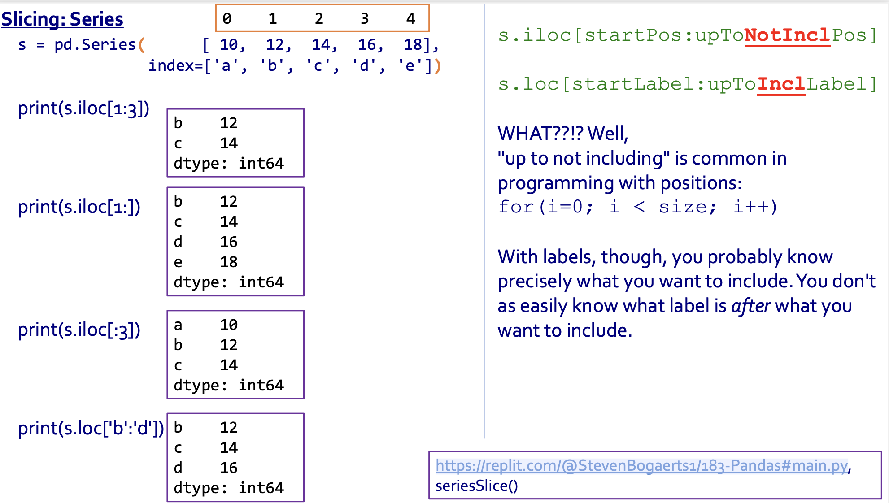

[TOC]

# Lec2: Introduction to C++

## 1.5 Variables (int)

1. Ex: `int userAge;` declares a new variable named userAge that can hold an integer value. The compiler allocates a memory location for userAge capable of storing an integer. **Allocation** is the process of determining a suitable memory location to store data like variables. Ex: In the animation below, the compiler has given userAge memory location 97, which is known as the variable's address. The choice of 97 is arbitrary and irrelevant to the programmer, but the idea that a variable corresponds to a memory location is important to understand.
2. When a statement that assigns a variable with a value executes, the processor writes the value into the variable's memory location. Likewise, reading a variable's value reads the value from the variable's memory location. The programmer must declare a variable before any statement that assigns or reads the variable, so that the variable's memory location is known.


Semicolon: `;`

Parenthesis: `()`

## 1.6 Variables and assignments(general)

1. `<<` is the insertion operator. Imagine direction of data flow.
2. `>>` is the extraction operator.
3. Use `endl` to insert a newline and “flush cout’s buffer”. It is defined in `iostream` library, in the `std` namespace.

### 1.6.1 Something about `>>`

for the extraction operator `>>`, 

1. It skips over leading whitespace characters, **including spaces, tabs and new lines**. 
2. Actually it reads but does **not store anywhere**
3. 输入字符串一般使用 **`getline(cin, str)`**
4. **Converts chars read to the expected datatype.**

### 1.6.2 类型转换

1. `double a = 1 /4  `  没有真的把 `a` 真的变成 `double` ! 最后结果会是 `0`! 必须要 `double a = 1.0/4`
   1. 如果 `double c = 1`, 输出 `c` 会是 `1` 而不是 `1.0`, 但这个时候它已经是 `double` 了！如果 `a/2`, 结果会是 `0.5`! 打印 值为整数的 `double` 结果会没有小数点，但是它绝对已经是 `double` 了而不是 `int`！
   2. 如果 `double c = 1; double a = c/4`, 那么`a` 就变成了正常结果 `0.25`！

下面是总结：

**一个类型要怎么样才能正确？**

我们分成两步：declare和assign.

**我们说：赋值屁用没有，只有declare决定结果. declare是什么type就是什么type！**

**那么为什么 `b = 1/4` 是 0呢？因为这是运算符号 `/` 因为左右两边都是整数所以识别成了整数的除法，而只要有一边有小数点就会识别为浮点数运算. 但这只是运算结果的不一样，最后赋值给变量的是什么值只取决于变量type的定义！**

```c++
double b
b = 1/4
cout << b;
// 0
```

```c++
int b;
b = 2.7/2;
cout << b;
//1
```

```c++
double b;
b = 2.7/2;
cout << b;
// 1.35
```

```c++
double b;
b = static_cast<int>2.7/1;
cout << b << endl 
// 2
b = b + 0.9;
cout << b;
// 2
```

```c++
int b;
b = static_cast<int>2.7/1;
cout << b << endl 
// 2
cout << b + 0.9;
// 2.9
// cout的东西的type就不是b的type，而是会自己判断
```


## 1.7 Library (std & iostream)

### 1.7.1 More about `cin`

1. `cin` is a variable of type `istream`.

```c++
Loose pseudocode for >> :
istream operator>>(istream operand1, manyPossibleTypes operand2) {
 read from operand1, put result in operand2
 return the updated operand1
}

cin >> x;
is:
operator>>(cin, x);
which is:
	read from cin, put result in x
	return the updated cin
```

operator `>> ` 其实是 `iostream` 库的一个函数，这个函数的一个参数是一个 `istream` 类的变量，比如 `cin`，另一个参数则是第一个参数的更新值.

也就是说，`cin >> a` 其实是 `operator>>(cin, a)` ，把 `a` 的值更新给了 `cin`，并把它作为函数的返回值返回了出来.

所以连续的输出，比如 `cin >> x >> y`，其内在逻辑是:


其实是从左到右的先后precedence，一直返回直到 `>>` 函数被消耗完.

### 1.7.2 `cin`  as a bool

In C++, most values can be used in a bool context, including istreams like `cin`.

`cin >> x` fails:
▪ x is set to a “zero value”
▪ Subsequent cin >> are totally ignored (no change to those variables)

总之就是当出现问题以致于 `x` 不能够成功读入 (比如错误的变量类型) 时，`cin >> x` 的bool值为 `false`。

Let’s check out: Event-controlled loop using `cin` with check value

```c++
cout << "Enter a value, or 0 to quit : ";
while (cin >> value && value != 0) 
{
	total += value;
	cout << "Enter a value, or 0 to quit : ";
}
```

`cin` loops:

```c++
int x;
while (cin >> x) 
{
	cout << (x + 1);
}
```

**For this condition to be false, must enter a value that will cause `cin` to fail. For example: a non-number.**

比如定义 `x` 是个 `int` 型，那么如果输入一个 `char`，`cin >> x` 的bool值就是false了.

总之通过这一段，我们主要了解了一个fact，就是C++中大部分表达式都有布尔值，甚至输入输出.

### 1.7.3 `stdio` library and preprocessor

1. 其实我们的 `cin >> x`, `cout << x` , ``endl`，能够成立的大背景都是 `stdio` library. 其实它们本来的样子是：`std::cin >> x`, `std::cout << x`, `std::endl`. 我们能简写是因为我们在文件中输入了 `using namespace std`;

2. **`string` 也是标准库的类！**这是c++的特色string；如果不喜欢这个string，也可以 `#include<cstring>`, 用c里面的string.

3. 我们知道在文件最开始要写 `include<iostream>`, 这个叫做 `header file` 头文件，目的就是把这些C++内置library的文件复制黏贴到这个文件中.
4. `#` 这个行为，我们称之为 preprocessor, 预处理命令，在文件执行前最先执行. 除了 `#include<library>` 之外还有其他的 preprocessor, 比如`#define`, 就比如 `#define N 188`, 就是把N这个东西定义为188，整个文件都能用. 此处不细说了.

# Lec3: Data Types

## 2.1 Arithmetic expressions (general)

1. x --2 这个表达式是valid的, 结果是7.

2. `n!` 并不valid, 实际上大部分高级语言都不支持 `!` 这个运算符号来表示factorial

### 2.1.1 precedence(优先级): 

| Operator          | Description                                                  | Explanation                                                  |
| ----------------- | ------------------------------------------------------------ | ------------------------------------------------------------ |
| **( )**           | Items within parentheses are evaluated first                 | In 2 * (x + 1), the x + 1 is evaluated first, with the result then multiplied by 2. |
| **unary -**       | - used for negation (unary minus) is next                    | In 2 * -x, the -x is computed first, with the result then multiplied by 2. |
| *** / %**         | Next to be evaluated are *, /, and %, having equal precedence. | (% is discussed elsewhere)                                   |
| **+ -**           | Finally come + and - with equal precedence.                  | In y = 3 + 2 * x, the 2 * x is evaluated first, with the result then added to 3, because * has higher precedence than +. Spacing doesn't matter: y = 3+2 * x would still evaluate 2 * x first. |
| **left-to-right** | If more than one operator of equal precedence could be evaluated, evaluation occurs left to right. | In y = x * 2 / 3, the x * 2 is first evaluated, with the result then divided by 3. |

## 2.2 Arithmetic expressions (int)

1. endl会输出新的一行, 如果下面还有内容会在这一行起, 如果没有了就会输出新的一行上一个空格, 不要忘了


## 2.3 Floating-point numbers (double)

1. .97不是error, 但是不建议这样写, 还是0.97.

2. 0.0/5.0会显示0.0而不是0.

3. 12.0/0.0是positive infinity而不会报错(显示inf)

4. 0.0/0.0 not a number即nan(显示nan)

5. ### Manipulating floating-point output

   Some floating-point numbers have many digits after the decimal point. Ex: Irrational numbers (Ex: 3.14159265359...) and repeating decimals (Ex: 4.33333333...) have an infinite number of digits after the decimal. By default, most programming languages output at least 5 digits after the decimal point. But for many simple programs, this level of detail is not necessary. A common approach is to output floating-point numbers with a specific number of digits after the decimal to reduce complexity or produce a certain numerical type (Ex: Representing currency with two digits after the decimal). The syntax for outputting the double myFloat with two digits after the decimal point is
   `cout << fixed << setprecision(2) << myFloat;`

   When outputting a certain number of digits after the decimal using cout, C++ rounds the last output digit, but the floating-point value remains the same. Manipulating how numbers are output is discussed in detail elsewhere.

   Note: setprecision() is found in the iomanip library. fixed and setprecision() are manipulators that need only be written once if the desired number of digits after the decimal point is the same for multiple floating-point numbers. Ex:

   ```
   cout << fixed << setprecision(3) << 3.1244 << endl;
   cout << 2.1 << endl;
   ```

   outputs 3.124 and 2.100.

   **注意，使用这个syntax需要 `#include<iomanip>` , 因为setprecision在这个library里. 并且不要忘记`<< fixed` 了!** 这里这个库函数的取整是四舍五入, 但是double强制转化成int就直接舍去小数点了, 就算4.99也要变4.

6. `#include<math>` , 可以使用 `M_PI` 这个constant, 就是 $\pi$.

7. 强制转化结果为float: 只需要更改分子就可以:


## 2.4 Identifiers

### 2.4.1 Keyword表

1. 数字+字母是invalid的, 变量名中数字不能写在最前面;
2. 变量名中间不能有空格, invalid
3. **An identifier must start with a letter (a-z or A-Z) or underscore ('_'), and can only contain letters, underscores, and/or digits (0-9).** `cat!` 也是invalid的变量名! 尽管没有 `!` 这个运算符.
4. underscore(_) 是**可以**写在最前面的
5. **language keyword**是invalid的变量名! 比如`short`
6. This variable name is a good balance between clarity and length.

key word 表:


## 2.5 Characters

### 2.5.1 ASCII表

**Table 2.5.1: Character encodings as numbers in the ASCII standard**


|  Binary  | Char  | Dec  |
| :------: | :---: | :--: |
| 010 0000 | space |  32  |
| 010 0001 |   !   |  33  |
| 010 0010 |   "   |  34  |
| 010 0011 |   #   |  35  |
| 010 0100 |   $   |  36  |
| 010 0101 |   %   |  37  |
| 010 0110 |   &   |  38  |
| 010 0111 |   '   |  39  |
| 010 1000 |   (   |  40  |
| 010 1001 |   )   |  41  |
| 010 1010 |   *   |  42  |
| 010 1011 |   +   |  43  |
| 010 1100 |   ,   |  44  |
| 010 1101 |   -   |  45  |
| 010 1110 |   .   |  46  |
| 010 1111 |   /   |  47  |

0110000(48) - 0111001(57): 0-9

|  Binary  | Char | Dec  |
| :------: | :--: | :--: |
| 011 1011 |  58  |  :   |
| 011 1100 |  59  |  ;   |
| 011 1101 |  60  |  <   |
| 011 1110 |  61  |  =   |
| 011 1111 |  62  |  >   |
| 011 1111 |  63  |  ?   |
| 100 0000 |  64  |  @   |

100 0001(65) - 101 1010(90): A-Z

|  Binary  | Char | Dec  |
| :------: | :--: | :--: |
| 101 1011 |  91  |  [   |
| 101 1100 |  92  |  \   |
| 101 1101 |  93  |  ]   |
| 101 1110 |  94  |  ^   |
| 101 1111 |  95  |  _   |
| 110 0000 |  96  |  `   |

110 0001(97) - 1111010(122): a-z

|  Binary  | Char | Dec  |
| :------: | :--: | :--: |
| 111 1011 | 123  |  {   |
| 111 1100 | 124  |  \|  |
| 111 1101 | 125  |  }   |
| 111 1110 | 126  |  ~   |

2. 注意ASCII只适用于char! 比如`7` is stored as 7, 而不是55; `'7'` is stored as 55.

3. 如果想要用ASCII码来索引字符, 那么就是 `char(ASCII)`. 比如 `char(32)` 表示空格, `char(97)` 表示 `‘a’`.
4. 字符一定要用 `''` 单引号来表示, 字符串一定要用 `""` 双引号表示
5. 字符相加, 比如 `‘a’ + ‘ ’`, 得到的结果是int, 为129, 是把它们的ASCII码相加的结果.

### 2.5.2 Common escape sequences(转义字符表)

Common **escape sequences(转义序列)**:

| Escape sequence |     Char     |
| :-------------: | :----------: |
|       \n        |   newline    |
|       \t        |     tab      |
|       \\'       | single quote |
|       \\"       | double quote |
|       \\\       |  backslash   |

escape sequences用于字符串内部, 比如在 `" "` 中还想要使用"", 则需要: 

`" \"\" "`

而不是:

`" "" "`

4. 注意C++的I/O是可以字符串和数字类型混在一起的.

## 2.6 Strings

1. C++和Python很大的一个不同点在于C++中double quote(双引号) 和 single quote(单引号) 有区别. **string只能用double quote来表示!! char只能用single quote来表示!!** eg: `"a"` 是一个string而不是一个char.
2. `cin` 输入string遇到空格会停的, 要注意string输入的时候避免空格; 但是如果上来就是空格则会忽略

### 2.6.1 `getline(cin, x)`

3. 也是因为第2条, 所以我么要有一种新的输入方法来输入带有空格的字符串: `getline(cin, ...变量名)`. 直接获取一整行的string, 包括空格. **首段的空格不会被忽略!!要注意, 比如"    Walk away"就会把 “   ” **也读进去. **并且如果第一行是空行那么就会直接读取空的一行!**

4. **最重要的一点! ** `getline()` 是会把换行符读进去的, 就是说如果写了两行东西, 用`cin` 读完了第一行后写 `getline()` 会获得blank string! 也就是 `""`. 而这个时候再加一个 `getline()` 才会读取下一行内容. 这种情况只会出现在 `cin` 和 `getline` 混用的情况下, 所以尽量不要混用. 如果每行都 `getline`就不会有这种问题.


## 2.7 Constant variables(常变量)

1. 当加上 `const` 的前缀, 一个变量就被定义成了不变的常数, 如果尝试改变它会导致报错.

2. 编程规范: const variable的变量名要全部大写以及用_来连接语义.

## 2.8 Type conversions(类型转换)

1. Rule:

- For an arithmetic operator like + or *, if either operand is a double, the other is automatically converted to double, and then a floating-point operation is performed. (加减乘除遇见double其它类型都变double)
- For assignments, the right side type is converted to the left side type.(变量赋值向左边看齐.)

2. ***double-to-int* conversion just drops the fraction: 4.9 becomes 4.**

3. **Type Casting(强制转换)**: 把一个类型强制转换成另一个, statement是 `static_cast<type>(expression)`.

   Eg:

   ```C++
   #include <iostream>
   using namespace std;
   
   int main() {
      int kidsInFamily1;       // Should be int, not double
      int kidsInFamily2;       // (know anyone with 2.3 kids?)
      int numFamilies; 
      
      double avgKidsPerFamily; // Expect fraction, so double
   
      kidsInFamily1 = 3;
      kidsInFamily2 = 4;
      numFamilies = 2; 
      
      avgKidsPerFamily = static_cast<double>(kidsInFamily1 + kidsInFamily2)
                         / static_cast<double>(numFamilies);
      
      cout << "Average kids per family: " << avgKidsPerFamily << endl;
      
      return 0;
   ```

4. **强制转换一定要注意的问题: 如果要通过强制转换来确保除法精度, 则一定只对分子进行强制转换为double而不是整个分式!!** 原因如下: 强制转换整个分式并不能改变精度.

   

5. int相除不会带来double!


即便declare了double, 如果assign一个分子分母是int的分式, 结果还是int! 但只要有一个被type casting了或者加了decimal那么结果就是double

6. **强制转换是去尾不是四舍五入**

### 2.8.1 Explicit Cast and Implicit Cast

```c++
int i = 4;
double d1 = static_cast<double>(i); //4.0, explicit cast
double d2 = i; //4.0, implicit cast
```

## 2.9 Integer division and modulo

1. 实践发现: 1/0并不会报error而是报warning, 并且结果是**1876948280**, 而当1/0.0, 结果则是`inf`.有趣的是n%0结果也是**1876948280**, 但其实应该是每个编译器不同的.
2. %是取余的意思. %只能在int中运算. 如果100.0%2, 会报error
3. Why parentheses(括号) matter: 有时候会不清楚precedence.
4. 有意思的: 生成一个-10到10之间的数:


# Lec4: Functions 1

## 3.1 Using math functions

1. `<cmath>`是一个standard math library.
2. Using math functions

| Function  | Behavior                                | Example                          |
| --------- | --------------------------------------- | -------------------------------- |
| sqrt(x)   | Square root of x                        | sqrt(9.0) evaluates to 3.0.      |
| pow(x, y) | Power: x to the y ($\displaystyle x^y$) | pow(6.0, 2.0) evaluates to 36.0. |
| fabs(x)   | Absolute value of x                     | fabs(-99.5) evaluates to 99.5.   |

3. 注意, sqrt只accept one argumen! 因而像什么 `sqrt(2.0, 8.0)` 是`error` 的. 只有一个argument, 只能返回square root(铁飞舞).

### 3.1.1 `floor()` and `ceil()`

`floor()`  就是去尾法，`ceil()` 就是进位法

`floor(5.1)` = 5

`floor(-3.6)` = -4

`ceil(5.1)` = 6

`ceil(-3.6)` = -3

总而言之不论正负数，`floor` 完更小，`ceil()` 完更大.

## 3.2 User-defined function basics

1. main function自己也是一个function definition.
2. 不可以`return;`, return必须返回一个值且仅返回一个值
3. function返回值可以是 `char`;
4. function可以是 `void`, 不返回值.
5. function的parameters不能在定义的括号里进行操作, 比如下面这个不行:


但是call function的时候是可以这样做的:


6. **注意, 如果想要返回double型, 那么不仅要注意表达式, define function的时候也要define返回值是double.** 这两点都是必须的! **反之亦然. define了function to be a double, 但是传入的是int, 那么表达式就必须要加一个double值, 比如本来是/3, 要变成/3.0, 否则结果还是返回int!**

## 3.3 Reasons for functions

Using functions may add lines due to the function name/parameters, return, and blank lines before/after. But reduced number of lines is not always best for program **readability**(可读性). Putting the expressions that do the calculations directly in the output statements would have led to very long output statements. Being able to use a function name **directly in an output statement** (or in any expression) is a related readability benefit of using functions.

使用function可以减少main函数里面的语句但并不代表main会run faster.

- **Modular development(模块开发)** is the process of dividing a program into separate modules that can be developed and tested separately and then integrated into a single program.

- **Incremental development(增量开发)** is a process in which a programmer writes, compiles, and tests a small amount of code, then writes, compiles, and tests a small amount more (an incremental amount), and so on.

  Incremental development may involve more frequent compilation, but ultimately lead to faster development of a program.

- A **function stub(函数桩)** is a function definition whose statements have not yet been written. 用于增量开发.

  Using function stubs mainly helps a programmer capture correct high-level behavior before getting distracted by low-level details.

- A function prototype(雏形):

```C++
int add(int a, int b);
```

# Lec5: Functions 2

## 4.1 Unit testing (functions)

1. test harness: A test harness is typically a separate program whose purpose is to test a function. Modifying an existing program and then modifying it back could introduce bugs.
2. Unit refers to a part of a program, typically a function. Unit testing means to test just that part, separately from other program parts.

3. 一个测试函数: `assert();`

```c++
#include <iostream>
#include <cassert>
using namespace std;

double HrMinToMin(int origHours, int origMinutes) {
   int totMinutes;  // Resulting minutes
   
   totMinutes = (origHours * 60) + origMinutes;
   
   return origMinutes;
}

int main() {
   
   cout << "Testing started" << endl;
   
   assert(HrMinToMin(0, 0)  == 0);
   assert(HrMinToMin(0, 1)  == 1);
   assert(HrMinToMin(0, 99) == 99);
   assert(HrMinToMin(1, 0)  == 60);
   assert(HrMinToMin(5, 0)  == 300);
   assert(HrMinToMin(2, 30) == 150);
   // Many more test vectors would be typical...
   
   cout << "Testing completed" << endl;
   
   return 0;
}
```

## 4.2 Scope(作用域) of variable/function definitions

1. The name of a defined variable or function item is only visible to part of a program, known as the item's **scope**

2. Because a compiler scans a program line-by-line from top-to-bottom, the scope starts *after* the declaration until the function's end

### 4.2.1 Global variable(全局变量) & Local Variable(局部变量)

3. A variable declared outside any function is called a **global variable**, in contrast to a *local variable* declared inside a function. A global variable's scope extends after the declaration to the file's end, and reaches into functions. A local variable is declared inside a function, while a global is declared outside any function. 
4. Global variables should be used sparingly. If a function's local variable (including a parameter) has the same name as a global variable, then in that function the name refers to the local item and the global is inaccessible. Such naming can confuse a reader. Furthermore, if a function updates a global variable, the function has effects that go beyond its parameters and return value, known as **side effects**. *Good practice* *is to minimize the use of non-const global variables.* (1) 尽量不要设置除了constant以外的全局变量. (2) 如果一个函数的local variable和一个global variable变量名一样，那么这个名字会归到local variable而不是global variable，但最好不要这么做. (3) 如果一个函数的local variable的名字和函数的一个parameter一样，那么会直接报error.
5. Local Variable的作用域并不是从括号开始到括号结束的，而是从declaration就开始了！

### 4.2.2 Function Declaration(aka prototype) & Function Definition

```C++
// (Function DECLARATION)
double ToCurrDollars (double pastDol, int pastYr, int currYr);

int main() 
{
	...
}

// (Function DEFINITION)
// Function returns equivalent value of pastDol in pastYr to currYr
double ToCurrDollars (double pastDol, int pastYr, int currYr) {
   double currDol;      // Equivalent dollar amount given inflation
   
   currDol = pastDol * pow(1.04, currYr - pastYr );
   
   return currDol;
}
```

1. 可以先不define function, 而是写一个叫function declaration或者也叫function prototype的东西，就是写一行东西说一下这个函数，而把实际的函数放在文件的最后面，这样就可以一眼看到main函数.
2. The declaration specifies the interface, while the definition specifies the contents.

```c++
int add(int a, int b);
```

3. **A common error is for the function definition to not match the function declaration**, such as a parameter defined as double in the declaration but as int in the definition, or with a slightly different identifier. The compiler detects such errors. 如果declaration和definition不一样是会报错的！

## 4.3 Debugging

1. Debugging也叫Troubleshooting，是一项core programmer task. 
2. Debugging第一步: predict problem; 第二步: test to validate
3. 并不是列出所有问题然后一个一个调试的，因为可能的问题太多了. 正确的方法是：A programmer thinks of a few possible problems, then tests the most likely first. Testing may lead to new predictions.

## 4.4 Pass-by-value(值传递)

1. C++ allows multiple **parameter-passing mechanisms**. 但是目前为止我们使用过的都是pass-by-value, 没有pass-by-reference(引用传递)的. 也就是说, `a = b` 传递的是a的值而不是地址, 即make a copy a.
2. function里面即便return了值也还是copy! 只有assign value 比如 `a = add(a)` 才改变a的值.

## 4.5 RME comment

在style guide里面我们大概知道了北美的程序员是要求在自己的函数declaration前面写RME comment的. 

```C++
Requires: 
What are the constraints on the arguments to the function?
e.g., number > 0 

Modifies: 
What is changed by the function (besides the returned value)? 
e.g., cin, cout

Effects:
What does the function do?
e.g., What value is returned? Does it print to cout?
```

下面是一个例子.

```C++
/**
* Returns the singular or plural form of a word, based on number 
*
* Requires: singular is the singular form of the word. 
*					  plural is the plural form of the word.
*						number determines how many things there are; 
*
* Modifies: Nothing.
* Effects: Returns the singular form of the word if number == 1. 
*					 Otherwise, returns the plural form.
*/
string pluralize(string singular, string plural, int number);
```

1. **The Requires clause is not enforced in the definition for a function. The function is created expecting that an argument not allowed by Requires of the RME will not be used as input whenever the function is called.** require主要是提示要输入什么东西的，不一定要在函数definition里为了require给出错误捕捉！甚至，如果因为错误捕捉改变了函数本来应该有的操作，那么反而是错的！

```c++
 /*
 * Requires: denominator != 0.0
 * Modifies: Nothing.
 * Effects:  Returns the result of division of numerator by denominator
 */
 double divide(double numerator, double denominator);
```


2. `cin` 和 `cout` 也是一种 Modify！

# Lec6: Branching

## 5.1 If-else branches (general)

In a program, a **branch** is a sequence of statements only executed under a certain condition. Ex: A hotel may discount a price only for people over age 65. An **if** branch is a branch taken only IF an expression is true.

注意：`else` 后面不能跟条件；`else if` 必须要有 `if` 才可以使用，否则报错.


## 5.2 Detecting equal values with branches

1. 等于: `==`
2. 不等于: `!=`
3. 大于等于和小于等于: `>=`, `<=`
4. **Floating-point types should not be compared using the equality operators, due to the imprecise representation of floating-point numbers, as discussed in a later section.** 不要比较float和double这两种类型的值! 会出现奇怪的结果

### 5.2.1 为什么不要连续的比较运算符

使用连续的比较运算符，不会报错，但是结果一定是错的. 因为根据优先级，Compiler会自动给你的式子打上括号，把它们变成bool value.


##  5.4 Detecting ranges using logical operators

1. And: `&&`
2. Or: `||`
3. Not: `!`
4. Inclusive: 包括等于, exclusive: 不包括等于

## 5.5 Detecting multiple features with branches

1. `if` 和`else if`和`else` 只有一个能实现！因为这是同一个if模块里的，但是重新再写一个`if`就是从上到下运行.

## 5.6 Common branching errors

1. Omitting brace: 那么只运行运行符之后的一句statement！比如如果

```C++
if (n == 1)
	n = 2;
	n = 3;
```

那么就只运行n=2, n=3就被忽略了, 最后的结果就是n=2.

2. 判断写成赋值

```C++
numItems = 3; 
if (numItems = 10) {
   numItems = numItems + 1;
}
```

结果是11, 因为先给它赋值为10, 然后改语句由于是赋值语句, 布尔值总是对的, 所以执行if, 加上1, 最后结果为11.

## 5.7 String comparisons

1. 字符串比较大小的方法：

   (1) 直接比首字母ASCII码大小；

   (2) 如果首字母一样就比较下一个，类推；

   (3) 如果所有前面字母都一样，后面其中一个字符串结束了，另外一个还没结束，比如`banana` 和 `bananarama`, 那么长的那个更大.

2. 注意，小写字母的ASCII比大写字母大! 首字母是小写的字符串肯定比首字母大写的要大

## 5.8 Boolean data type

1. 不多说, `if(...==true)`是不符合规范的，应该`if(...)`, 直接用它的布尔值, 至于具体离散数学讲过.

## 5.9 Floating-point comparison

前面讲了用 `==` 比较float或者double型是会出问题的. 那么应该怎么比呢? 其实根本原因是浮点数的小数点后面很多位因为计算机的存储方式是有问题的，所以基本不会有完全相等的浮点数，但是可以比较它们的前几位. 一种最好的方式是: 

```C++
fab(x - 1.0) < 0.0001
```

这样就把误差控制在0.0001之内, 那么基本就说明算对了.

### 5.9.1 浮点数的存储方式


符号1bit，整数8bit，小数点23bit，一共32bit，这就是IEEE标准的32位浮点数存储方式.

# Lec7: Loops 1

## 6.2 While loops

A **while loop** is a program construct that repeatedly executes a list of sub-statements (known as the **loop body**) while the loop's expression evaluates to true. Each execution of the loop body is called an **iteration**. Once entering the loop body, execution continues to the body's end, even if the expression would become false midway through.


1. 上图是一个典型的问题，这其实是一个无线循环，因为判断相等写成了赋值的等号，在python是会报错的，但C++会识别这是一个布尔表达式，值永远是true. 

## 6.4 Functions with branches

1. 当一个函数嵌套另外一个函数时, main函数先调用外层函数再调用里层函数.

## 6.6 Developing programs incrementally

1. Experienced programmers develop programs **incrementally**, meaning they create a simple program version, and then grow the program little-by-little into successively more-complete versions.
2. A **FIXME comment** is commonly used to indicate program parts to be fixed or added, as below. Some editor tools automatically highlight the FIXME comment to attract the programmer's attention.
3. FIXME comments should be replaced by actual code in a completed program.

# Lec8: Loops 2

## 7.1 For loops

1. A **for loop** is a loop with three parts at the top: a loop variable initialization, a loop expression, and a loop variable update.

### 7.1.1 `i++` 和 `++i`

1. Note: Actually two increment operators exist: `++i` **(pre-increment)** and `i++` **(post-increment)**. ++i increments before evaluating to a value, while `i++` increments after. Ex: If i is 5, outputting `++i` outputs 6, while outputting `i++` outputs 5 (and then i becomes 6). This material primarily uses `++i` for simplicity and safety, although many programmers use `i++`, especially in for loops. 简而言之: `++i` 的 `++` 在传输 `i` 之前 `i` 的值就增加了，`i++` 的 `++` 在传输 `i` 之后 `i` 的值才增加. 也就是说，如果输出 `i++`, 那么输出的还是 `i` 的值，`++` 的结果没有输出去，而这一句statement之后 `i` 的值才变化. 

```C++
int main()
{
	int i = 1;
	cout << ++i; 
    //输出 2
    
    int i = 1;
    cout << i++;
    //输出 1
}
```

2. 如果在loop的body part里面再写一个 ` ++i` 或者 `i++`, 那么`i` 会increment两次
3. 以下代码会报错吗? 不会. 实际上在循环的initialization和update parts里面塞乱七八糟的东西是不会报错的，但是别这么干.

```C++
// initialExpression not related to counting iterations; move r = rand() before loop
for (i = 0; r = rand(); i < 5; ++i) {
   // Loop body 
}

// updateExpression not related to counting iterations; move r = r + 2 into loop body
for (i = 0; i < 5; ++i, r = r + 2) {
   // Loop body 
}
```

## 7.3 Nested loops

1. A **nested loop** is a loop that appears in the body of another loop. The nested loops are commonly referred to as the **inner loop** and **outer loop**. Nested loops have various uses. One use is to generate all combinations of some items. 

## 7.4 Variable name scope

1. A declared name is only valid within a region of code known as the name's **scope**. Ex: A variable `userNum` declared in `main() ` is only valid within `main()`, from the declaration to main()'s end.

2. A **block** is a brace-enclosed `{...}` sequence of statements, such as found with an if-else, for loop, or while loop. A variable name's scope extends from the declaration to the closing brace `}`.

## 7.5 Order of evaluation(附优先级表格)

在2.1中我们给出了一个precedence table, 这里再补充一点.

| Operator/Convention  |                         Description                          |                         Explanation                          |
| :------------------: | :----------------------------------------------------------: | :----------------------------------------------------------: |
|        `( )`         |         Items within parentheses are evaluated first         | In `(a * (b + c)) - d`, the + is evaluated first, then *, then -. |
|         `!`          |                   ! (logical NOT) is next                    |            `! x || y` is evaluated as `(!x) || y`            |
| `*` `/` `%` `+` `-`  | Arithmetic operators (using their precedence rules; see earlier section) |     `z - 45 * y < 53` evaluates * first, then -, then <.     |
| `<`  `<= ` `>`  `>=` |                     Relational operators                     | `x < 2 || x >= 10` is evaluated as `(x < 2) || (x >= 10)` because < and >= have precedence over \|\|. |
|      `==`  `!=`      |              Equality and inequality operators               | `x == 0 && x >= 10` is evaluated as `(x == 0) && (x >= 10)` because < and >= have precedence over &&. == and != have the same precedence and are evaluated left to right. |
|         `&&`         |                         Logical AND                          | `x == 5 || y == 10 && z != 10` is evaluated as `(x == 5) || ((y == 10) && (z != 10))` because && has precedence over \|\|. |
|         `||`         |                          Logical OR                          | \|\| has the lowest precedence of the listed arithmetic, logical, and relational operators. |

既然都这样了那就再补充一点吧. 下面应该是所有了

1. 优先级1, 方向左到右:

| **运算符** | **名称或含义**  | **使用形式** |
| :--------: | :-------------: | :----------: |
|    `[]`    |    数组下标     |    `a[]`     |
|    `()`    |     圆括号      |   `()/()`    |
|    `.`     | 成员选择 (对象) | `a.property` |
|    `->`    | 成员选择 (指针) |    `a->`     |

2. 优先级2, 方向**右到左（！！）**

**我们可以发现, `++` 的优先级大于 `+`, 这就不得不引出一个经典问题`i=1, i++ + ++i = ? `而答案是其实没有标答, 因为这是一个undefined行为, 一般的编译器会给3+3=6. 我只能说, 逆天才这么写.**

| **运算符** | **名称或含义** | **使用形式**  |
| :--------: | :------------: | :-----------: |
|    `-`     |      负号      |     `-a`      |
|    `~`     |    按位取反    |     `~a`      |
|    `++`    |      自增      |  `++a` `a++`  |
|    `--`    |      自减      |  `--a` `a--`  |
|    `*`     |   取值(指针)   |  `*指针变量`  |
|    `&`     |     取地址     |   `&变量名`   |
|    `!`     |     逻辑非     |     `!a`      |
|  `(type)`  |  强制类型转换  |  `(double)a`  |
|  `sizeof`  |      长度      | `sizeof(str)` |

3. 优先级3, 方向左到右

| **运算符** | **名称或含义** | **使用形式** |
| :--------: | :------------: | :----------: |
|    `/`     |       除       |    `a/3`     |
|    `*`     |       乘       |    `a*3`     |
|    `%`     |      取模      |    `a%3`     |

4. 优先级4, 方向左到右

| **运算符** | **名称或含义** | **使用形式** |
| :--------: | :------------: | :----------: |
|    `+`     |       加       |    `a+3`     |
|    `-`     |       减       |    `a-3`     |

5. 优先级5, 方向左到右

| **运算符** | **名称或含义** |   **使用形式**   |
| :--------: | :------------: | :--------------: |
|    `<<`    |      左移      |  `变量<<表达式`  |
|    `>>`    |      右移      | ``变量>>表达式`` |

6. 优先级6, 方向左到右

   `>`, `<`, `>=`, `<=`

7. 优先级7, 方向左到右

   `==`, `!=`

   (我们可以发现, 本来以为比较运算符的优先级是一样的, 但是其实等于和不等于的优先级比大于小于之类的要低一点.)

8. 优先级8, 方向左到右

| **运算符** | **名称或含义** |  **使用形式**   |
| :--------: | :------------: | :-------------: |
|    `&`     |     按位与     | `表达式&表达式` |

9. 优先级9, 方向左到右

| **运算符** | **名称或含义** |  **使用形式**   |
| :--------: | :------------: | :-------------: |
|    `^`     |    按位异或    | `表达式^表达式` |

10. 优先级10, 方向左到右

| **运算符** | **名称或含义** |  **使用形式**   |
| :--------: | :------------: | :-------------: |
|    `|`     |     按位或     | `表达式|表达式` |

11. 优先级11, **逻辑运算符**, 方向左到右

| **运算符** | **名称或含义** |   **使用形式**   |
| :--------: | :------------: | :--------------: |
|    `&&`    |     逻辑与     | `表达式&&表达式` |

12. 优先级12, **逻辑运算符**, 方向左到右

    **(我们可以发现, 逻辑与或的优先级是非常低的, 除了赋值运算符外, 基本只要是正常运算符都比它高)**

| **运算符** | **名称或含义** |   **使用形式**   |
| :--------: | :------------: | :--------------: |
|    `||`    |     逻辑或     | `表达式||表达式` |

13. 优先级13, **条件运算符**, 方向**右到左(！！)**

    (这是一个**三目运算符**)

    | **运算符** | **名称或含义** |             **使用形式**             |
    | :--------: | :------------: | :----------------------------------: |
    |    `?:`    |   条件运算符   | `表达式1?`  (换行) `表达式2:表达式3` |

14. 优先级13, **赋值运算符**, 方向**右到左(！！)**

    **我们可以看到, 赋值运算符的运算是在最后面的.**

    **另一个有趣的点是, `i++` 和 `i += 1` 是一个意思,但是优先级不一样. 直接赋值的优先级最高.**

| **运算符** | **名称或含义** | **使用形式**  |
| :--------: | :------------: | :-----------: |
|    `=`     |      赋值      | `变量=表达式` |
|    `/=`    |    除后赋值    |      ...      |
|    `*=`    |    乘后赋值    |      ...      |
|    `%=`    |   取模后赋值   |      ...      |
|    `+=`    |    加后赋值    |      ...      |
|    `-=`    |    减后赋值    |      ...      |
|   `<<=`    |   左移后赋值   |      ...      |
|   `>>=`    |   右移后赋值   |      ...      |
|    `&=`    |  按位与后赋值  |      ...      |
|    `^=`    | 按位异或后赋值 |      ...      |
|    `|=`    |  按位或后赋值  |      ...      |

# Lec9: Strings

## 8.1 Character operations

### 8.1.1 char类型的判断函数

`isalpha()`, `isdigit()`, `isspace()`, `toupper()`, `tolower()`. 这些从名字就看得出来很简单易懂(C++居然也有这种东西)

|    Operator    |            Function            |                           Example                            |    Operator    |     Function      |                           Example                            |
| :------------: | :----------------------------: | :----------------------------------------------------------: | :------------: | :---------------: | :----------------------------------------------------------: |
| **isalpha**(c) | true if alphabetic: a-z or A-Z | `isalpha('x') // true isalpha('6') // false isalpha('!') // false ` | **toupper**(c) | Uppercase version | `letter = toupper('a')  // A letter = toupper('A')  // A letter = toupper('3')  // 3 ` |
| **isdigit**(c) |      true if digit: 0-9.       |        `isdigit('x') // false isdigit('6') // true `         | **tolower**(c) | Lowercase version | `letter = tolower('A')  // a letter = tolower('a')  // a letter = tolower('3')  // 3 ` |
| **isspace**(c) |      true if whitespace.       | `isspace(' ')  // true isspace('\n') // true isspace('x')  // false` |                |                   |                                                              |

**要注意的是这个也是值传递而不是引用传递，不会改变原值的. **

而且alpha只包括26个大写和小写字母.

### 8.1.2 `xxx.at(i)`

1. 获取一个字符串的第 `i` 个字符: `xxx.at(i)`. **这个是引用传递！！！**很奇怪为什么但是这个确实就是引用传递，会改变原址的值的.
2. `.at(i)` 的 `i` 超出字符串长度会报错. 放心不会传到其他不相干的地址去，只报错.
3. 获取字符串长度: `xxx.size()`
4. 要知道一个字符是不是小写字母，只要看看 `a >= 97 && a <= 122` 是否为真可以了，运算中自动调用ASCII码. 

用一下这两个东西写一串代码: 把字符串里所有是数字的字符改成 `'^'`.

```C++
int main() 
{
   string inString;
   getline(cin, inString);
   
   /* Your code goes here */
   for (int i = 0; i < inString.size(); i++)
   {
      if (isdigit(inString.at(i)))
      {
         inString.at(i) = '^';
      }
   }
   
   cout << inString << endl;
   return 0;
}
```

 再举一个例子:

Read a 2-character string from input into variable `userString`. Declare a Boolean variable `noDuplicates` and assign `noDuplicates` with true if the following conditions are met:

- `userString` does *not* contain two of the same character.
- For alphabetic characters, `userString` does *not* contain two of the same letter (regardless of case).

Otherwise, assign `noDuplicates` with false.

Ex: If the input is `k%`, then `noDuplicates` is assigned with true, so the output is:

```
Good string
```

Ex: If the input is `Zz`, then noDuplicates is assigned with false, so the output is:

```
Bad string
```

```C++
int main() {
   string userString;
   bool noDuplicates = true;
   /* Your code goes here */
   getline(cin, userString);
   for (int i = 0; i < userString.size(); i ++)
   {
      for (int j = i + 1; j < userString.size(); j ++)
      {
         if (userString.at(i) == userString.at(j))
         {
            noDuplicates = false;
         }
      }
   }
   
   for (int i = 0; i < userString.size(); i ++)
   {
      if (isalpha(userString.at(i)))
      {
         for (int j = i + 1; j < userString.size(); j ++)
         {
            if (tolower(userString.at(i)) == tolower(userString.at(j)))
            {
               noDuplicates = false;
            }
         }
      }
   }
   
   
   if (noDuplicates) {
      cout << "Good string" << endl;
   }
   else {
      cout << "Bad string" << endl;
   }

   return 0;
}
```

## 8.2 String access operations

1. 我们之前说了，`.at()` surprisingly是一个引用传递. 对它进行赋值会改变原char的值. 那么问题来了: 如果我给这个东西赋两个char大小的值呢?

   ```C++
   string name = "Ron";
   name.at(0) = "XX";
   ```

   答案是会`error`, 而不是会往原字符后面推.

2. index是从0开始的, 但是**length是真实的length**. 一个3个char的string的length就是3, 虽然最后一个index是2. 因而size总比last index要大1.

### 8.2.1 `xxx.append(item)`

可以通过 `xxx.append()` 来在一个字符串后面接另一个字符串. **但需要注意的是只能是字符串而不能是字符! **我们知道，区分字符和字符串主要是字符只有一个且用单引号，而字符串用双引号. 

不过如果用了双引号就说明是字符串，即便只有一个字符，也是字符串而不是字符！

像

```C++
string x = "111";
x.append('a');
```

结果是 `error`. 因为不能append字符.

但是

```C++
string x = "111";
x.append("a");
```

结果是 `111a`, 因为 `"a"` 现在是个字符串了.

1. `append` 也会改变原值

### 8.2.2 `xxx.find(item)`, `xxx.replace(index, num, subStr)`

- `string.find(item)` returns the index of the first occurrence of item in string. If no occurrence is found, then the function returns `string::npos`.
- `string.replace(indx, num, subStr)` replaces characters at indices `indx` to `indx+num-1` with a copy of `subStr`.

Ex: 找出字符串里所有"000"并全部删除

```C++
while (keyStr.find("000")+1)
{
    int idx =  keyStr.find("000");
    keyStr.replace(idx, 3, "");
}
```

## 8.4 Input string stream

### 8.4.1 Input string stream

Sometimes a programmer wishes to read input data from a string rather than from the keyboard. A new **input string stream** variable of type **istringstream** can be created that **reads input from an associated string instead of the keyboard (standard input)**. istringstream is derived from istream. An istringstream can be used just like the cin stream as illustrated in the program below.

```C++
#include <iostream>
#include <sstream>
#include <string>
using namespace std;


int main() {
   string  userInfo = "Amy Smith 19"; // Input string
   istringstream inSS(userInfo);      // Input string stream
   string firstName;                  // First name   
   string lastName;                   // Last name
   int userAge;                       // Age
  
   // Parse name and age values from input string
   inSS >> firstName;
   inSS >> lastName;
   inSS >> userAge;


   // Output parsed values
   cout << "First name: " << firstName << endl;   
   cout << "Last  name: " << lastName << endl;
   cout << "Age: "        << userAge << endl;
 
   return 0;
}
```

这就要include一个library叫做 `<sstream>`. 这个包里面包含了一个 `class` 叫做 `isstringstream`. 

1. `istringstream inSS(userInfo);` declares a new string stream variable and initializes the string stream's buffer to **a copy of** string `userInfo`.

上面就创建了一个 `istringstream` 类的对象 `inSS`, 并且在declare对象的同时, 将它的值initialize为了 `userInfo` 的一个 **copy**. (注意这里只传递copy不改变原值)

2. Then the program extracts data from stream `inSS` using `>>`, similar to extracting from `cin`.

3. The extracted data is output to the screen.

```c++
#include <iostream>
#include <string>
#include <sstream>
using namespace std;

int main() {
   istringstream inSS;       // Input string stream
   string lineString;        // Holds line of text
   string firstName;         // First name
   string lastName;          // Last name
   int    userAge;           // Age
   bool   inputDone;         // Flag to indicate next iteration

   inputDone = false;
   
   // Prompt user for input
   cout << "Enter \"firstname lastname age\" on each line" << endl;
   cout << "(\"Exit\" as firstname exits)." << endl << endl;
   
   // Grab data as long as "Exit" is not entered
   while (!inputDone) {
      
      // Entire line into lineString
      getline(cin, lineString);
      
      // Copies to inSS's string buffer
      inSS.clear();
      inSS.str(lineString);
      
      // Now process the line
      inSS >> firstName;
      
      // Output parsed values
      if (firstName == "Exit") {
         cout << "   Exiting." << endl;
         
         inputDone = true;
      }
      else {
         inSS >> lastName;
         inSS >> userAge;
         
         cout << "   First name: " << firstName << endl;
         cout << "   Last  name: " << lastName << endl;
         cout << "   Age:        " << userAge   << endl;
         cout << endl;
      }
   }
   
   return 0;
}
```

### 8.4.2 Using `getline()` with string streams

A common use of string streams is to process user input line-by-line. The program below reads in a line as a string and then extracts individual data items from the string. The getline() function reads an input line into a string, and `inSS.str(lineString);` uses the str() function to initialize the stream's buffer to string `lineString`. Afterwards, the program extracts input from inSS using >>. The statement `inSS.clear();` is necessary to reset the state of the stream so that subsequent extractions start from the beginning of the input strings.

1. `str()` copies the input string into the string stream.

   eg: `inSS.str(xxx)`: copy string xxx的值到 inSS 这个istringstream的对象中去.

2. `clear` resets the string stream's state.

3. The standard function `getline(cin, ...)` is used to read an entire string from user input.

```c++
#include <iostream>
#include <string>
#include <sstream>
using namespace std;

int main() {
   istringstream inSS;       // Input string stream
   string lineString;        // Holds line of text
   string firstName;         // First name
   string lastName;          // Last name
   int    userAge;           // Age
   bool   inputDone;         // Flag to indicate next iteration

   inputDone = false;
   
   // Prompt user for input
   cout << "Enter \"firstname lastname age\" on each line" << endl;
   cout << "(\"Exit\" as firstname exits)." << endl << endl;
   
   // Grab data as long as "Exit" is not entered
   while (!inputDone) {
      
      // Entire line into lineString
      getline(cin, lineString);
      
      // Copies to inSS's string buffer
      inSS.clear();
      inSS.str(lineString);
      
      // Now process the line
      inSS >> firstName;
      
      // Output parsed values
      if (firstName == "Exit") {
         cout << "   Exiting." << endl;
         
         inputDone = true;
      }
      else {
         inSS >> lastName;
         inSS >> userAge;
         
         cout << "   First name: " << firstName << endl;
         cout << "   Last  name: " << lastName << endl;
         cout << "   Age:        " << userAge   << endl;
         cout << endl;
      }
   }
   
   return 0;
}
```

```c++
/*output:
Enter "firstname lastname age" on each line
("Exit" as firstname exits).

Mary Jones 22
   First name: Mary
   Last  name: Jones
   Age:        22

Sally Smith 14
   First name: Sally
   Last  name: Smith
   Age:        14

Exit
   Exiting.
*/
```

### 8.4.3 Reaching the end of a string stream

A programmer will not always know how much data exists in a user input string, so using multiple individual extractions (Ex: `inSS >> data1; inSS >> data2;`) is not useful for reading all of the input data. Input streams have a Boolean function called `eof()`or **end of file** that returns true or false depending on whether or not the end of the stream has been reached. An if statement or while loop can check if the end of input string stream has been reached by using the extraction operator. 

Ex: In the code

```
while (inSS >> data) {
   ...
}
```

the while statement implicitly calls `inSS`'s `eof()` function, which returns **false if more data exists in the string stream to be read** and **true if the end of string stream has been reached**. When `eof()` returns false, `inSS >> data` resolves to true, causing the loop to continue. Conversely, when `eof()` returns true, `inSS >> data` resolves to false, meaning the end of the string stream has been reached, and the loop exits.

## 8.5 More about `getline`

让我们看一个问题：


[TOC]

# Lec10: Pass by Reference

## 9.1 Pass by reference

1.

到现在为止，我们见过的函数都是**pass by value(值传递)**，也就是通过创建一堆临时变量，获得一个return值或者输出一个东西. 唯一改变一个variable的value的方法就是assign新的value，比如调用一个函数，把return值assign给传进去的变量.

但是C++ supports another kind of parameter that enables updating of an argument variable. 那就是**pass by reference(引用传递)**.

A **pass by reference** parameter does *not* create a local copy of the argument, but rather the parameter **refers directly to the argument variable's memory location**. Appending `&` to a parameter's data type makes the parameter pass by reference type.

pass by reference也很简单. 那就是直接在parameter的变量类型和变量名加上一个 `&`. 这其实是一个运算符，叫做取地址运算符.

```C++
void ConvHrMin(int timeVal, int &hrVal, int &minVal) {
   hrVal = timeVal / 60;
   minVal = timeVal % 60;
}
```

这个函数的第2和第3个parameter会直接调用输入的变量的地址，最后会直接改变这两个变量的值.

在这一例子中，**我们可以发现，pass by value 和 pass by reference 在同一个函数里面是可以混用的！**比如上面，就是pass了timeVal的value，hrVal和minVal的值.

可以通过这种机制来传入两个值并改变其中一个

```C++
bool CurveGrade(int score, char &grade)
{
   if(score >= 58 && score < 70 && grade != 'D')
   {
      grade = 'D';
      return true;
   }
   else
   {
      return false;
   }
}
      

int main() {
   int studentTotal;
	char studentGrade;
   bool isChanged;

   cin >> studentTotal;
   cin >> studentGrade;

   isChanged = CurveGrade(studentTotal, studentGrade);

   if (isChanged) {
      cout << "Grade is " << studentGrade << " after curving." << endl;
   }
   else {
      cout << "Grade " << studentGrade << " is not changed." << endl;
   }

   return 0;
}
```

2.

pass by reference不仅可以应用到函数的parameter, 普通的变量也可以使用.

```C++
double treeHeightFt = 7.1;
double& heightRef = treeHeightFt;

heightRef = 12.2;
cout << treeHeightFt; //12.2

treeHeightFt = 1.1;
cout << heightRef; //1.1
```

3.

可以通过定义pass by value的函数来输入值

```C++
#include <iostream>
using namespace std;

void GetLength(int& kilometers, int& meters)
{
    cin >> kilometers >> meters;
}

int main() {
    int usrKilometers;
	int usrMeters;

    GetLength(usrKilometers, usrMeters);

    cout << usrKilometers << " kilometers and " << usrMeters << " meters" << endl;
   
    return 0;
}
```

但是这是assign a pass by reference parameter in a function. 而**Assign a pass by value in a function is discouraged!**

(1) 坏处1

Assigning a pass by value parameter in a function is discouraged due to potentially confusing a program reader into believing the argument is being updated.

(2) 坏处2

Assigning a pass by value parameter in a function is discouraged due to potentially leading to a bug where a later line of code reads the parameter assuming the parameter still contains the original value.

(3) 好处(但没用)

Assigning a pass by value parameter can avoid having to declare an additional local variable. BUT, avoiding having to declare an additional local variable is not very important.


## 9.2 Common error of using `&`


1. 取地址后是不能直接放进普通的 `int` 变量里面的. 否则会报错

   函数里的引用传递其实是一种限制性比较强的操作. 我们知道，pass by value是创造临时变量，等到scope结束之后删掉，而如果在变量前加上 `&` 取地址符来pass by value，就是声明直接定位到memory中传入变量的位置，对这个变量进行操作.

   那么如果我就是要获得这个变量的地址呢？请看下一节.

2. 引用特有的对type要求严格:

   

​	声明type和传入type不一样，一般的函数是会将就一下的，但是如果你是 pass by reference的函数，会报错.

3. pass by reference不能传入表达式当懒狗，不然也会报错.

   

## 9.3 pointer

pointer是一个很重要的概念，但是在280里才详细讲. 我们这里需要自学多一点.

pointer型变量是用来存放变量地址的变量.


```c++
int    *ip;    // ip为int类型指针
double *dp;    // dp为double类型指针
float  *fp;    // fp 为float类型指针
char   *ch     // ch为char型指针
struct A {
 int a;
 int b;
};
A *a; // a为A型指针
```

指针的类型不止是 `int`, 可以是任何合法的包括自定义类型.

### 9.3.1 指针类型的赋值规范

```c++
//变量p存放的a的地址
int a = 5;
int *p;
p = &a;
//or: int *p = &a;
cout << "p = " << p << endl;
```

```c++
p = 6618636
```

6618636就是变量a的地址了

**指针类型 `int *p`, 可以理解为变量名叫p，类型为 `int *`，也就是整型的指针类型. 这样理解为更好一点.**


### 9.3.2 Multi-level pointer(多级指针)


我们可以发现，这个东西并不是像我们想的一样，一个 `*` 就能存一个任意变量的地址. 一个指针变量的地址要用 `**` 来存放. 但是其实这个理解起来是很容易的. 

`int **c` 是什么？我们这样看，把它拆成 `int *` 和 `*c`. 我们知道 `int *` 是定义一个指针变量，而 `*c` 是表示 `c` 是一个指针变量. 就是说，我们用 `*` 来标识指针变量. 那么因而一个指针变量的指针就有两个 `*`，这很正常.


那么 `int ***p` 也是一样的. `*p` 表示这是一个指针变量，而 `**p`是 `*(*p)`，表示这整个东西也是一个存放里面东西的指针变量，以此类推.


很简单，一块内存要么存放变量，要么存放变量地址. 指针本身也是一个变量.

### 9.4 `const` 关键字的补充知识

### 9.4.1 `const` 各种用法

1. `const` 优先修饰左侧量，如果左侧没有才修饰右侧量.

   ```c++
   /* c 是一个指向int型的指针，指针所指向地址的内容不能改，但该指针可以改； */
       const int *c;
   
   /* e 是一个指向int类型的指针，指针是const类型，指向的内容可变，但指针不能变；*/
       int  *const e = NULL;
       int var5 = 15;
       // e = &var5; //error,  定义的时候e指向空，指针不能变，不能指向新的地方；
   
   /* f 是一个指向int类型的指针，指针和指向的内容都不能改； */
       const int * const f = NULL;
   ```

2. `const` 修饰函数的返回值:

   ```c++
   /* 返回const int的值，返回值的内容不可修改, 无意义，因为函数的返回值本身要给其他变量 */
   const int MyFun(); 
   
   /* 返回指向int类型的指针，指针指向的内容不可修改，也即返回的内容不可修改*/
   const int* MyFun();
   
   /* 返回指向int类型的指针，该指针本身不可修改 */
   int *const MyFun();
   ```

3. `const` 修饰函数的参数

   ```c++
   /* 传递一个内容不可变的int型参数，无意义，值传递，函数内部会赋值一个临时变量*/
   void MyFun(const int a);
   
   /* 传递一个指向int类型的指针参数，指针本身不可变，无意义，值传递，函数内部会产生一个临时变量，承接该变量，本来就不会改变 */
   void MyFun(int *const a);
   
   /* 传递一个指向int类型的指针参数， 传递的内容不可变，虽然为值传递，产生一个临时的指针，但是指针所指向的内存空间不能变*/
   void MyFun(const int * a);
   
   /* 传递一个int类型的引用，该引用的内容不可变， 意义不大 */
   void MyFun(const int &a);
   
   /* 引用传递，传递一个对象的引用，函数内不能改变该对象的值， 避免修改，不产生临时变量，避免了临时变量构造和析构过程 */
   void MyFun(const A_st &a);
   ```

4. `const` 在 class 的 member function中, 跟在function后面.

   ```c++
   void display() const
   ```

   表示该函数只能是只读的，不能修改私有变量的值，增加安全性.

### 9.4.2 `const` 本质

c中const类型的本质：

- 是一个假的const类型，看上去不可修改，但实际通过指针能够间接修改；

  ```c
  int main()
  { 
    const int a  = 1;
    int *p = (int *)&a; //一个类型转换
    printf("a-1: %d\n", a); //1
    *p = 10;
    printf("a-2: %d\n", a); //10
  }
  ```

- const 变量在定义的时候就会开辟内存空间进行存储；

c++中const类型的本质：

- 是真正的const类型，不能间接进行修改；

  ```c++
  int main()
  { 
    const int a  = 1;
    int *p = (int *)&a; //一个类型转换
    printf("a-1: %d\n", a); //1
    *p = 10;
    printf("a-2: %d\n", a); //1
  }
  ```

- 定义时，变量并不开辟内存空间，不会存储在内存中，而是开一张哈希表，以key-value的形式存储；

### 9.4.3 跨文件 `const` 

```c++
extern const int x = 1;
```

当const变量进行普通使用的时候，直接去表里面进行查表，拷贝过来用； 当有取地址操作（&，包含引用）或者extern操作（跨cpp文件使用）的时候，会开辟一片内存空间，从表中将值复制过来，存储在该内存空间. 所以无论普通使用，还是通过取地址等操作，值都没有变，都来源那个表；

`const` 内容来源: 知乎[布期而遇](https://www.zhihu.com/people/18908638950)

# Lec12: Arrays 1

## 10.1 Array&vector concept(general)

1. array定义方法: `type a[size]`，size是元素个数，type是类型，a是数组名称，比如 `int a[10]` 就是一个元素类型为 `int` 的有10个元素的名字是 `a` 的数组.
2. array的第一个元素index为0，最后一个元素index为size -1！！比如定义一个数组 `a[10]` 的第一个元素是 `a[0]`，最后一个元素是 `a[9]`，没有 `a[10]`！！虽然定义的时候是这么写的，但是没这个元素
3. **array的definition不能超过它的大小！否则compiler error. 但是，如果call array的时候call了out of range的下标，比如 对于 一个有10个元素的array，call了`a[10]`，结果并不会报错，而是undefined behavior，根据编译器和环境不同给出内存里奇奇怪怪的结果. 这一行为和数组名就是指针有关系，不细说.**

## 10.2 Arrays

### 10.2.1 Array initialization

An array's elements are not automatically initialized during the variable declaration and should be initialized before being read. A programmer may initialize an array's elements in an array variable declaration by specifying the initial values in braces {} separated by commas. Ex: `int myArray[3] = {5, 7, 11};` initializes element at index 0 with 5, element at index 1 with 7, and element at index 2 with 11. For larger arrays, a loop may be used for initialization.

Like other variables, the keyword **const** may be prepended to an array variable declaration to prevent changes to the array. Thus, `const int YEARS[3] = {1865, 1920, 1964};` followed by `YEARS[0] = 2000;` yields a compiler error.

## 10.4 Iterating through arrays

## 10.5 Multiple arrays

首先，我们要知道一件事情，就是array是没有 `.size` 这个属性的.这是C++里 `std::string` 特有的属性.

Programmers commonly use multiple same-sized arrays to store related lists. The program below maintains a list of letter weights in ounces, and another list indicating the corresponding postage cost for first class mail (usps.com).

The `if (userLetterWeight <= letterWeights[i])` statement compares the user-entered letter weight with the current element in the `letterWeights` array. If the entered weight is less than or equal to the current element in the `letterWeights` array, the program prints the element in postageCosts at the same index.

The loop's expression `(i < NUM_ELEMENTS) && (!foundWeight)` depends on the value of the variable `foundWeight`. This expression prevents the loop from iterating through the entire array once the correct letter weight has been found. Omitting the check for found from the loop expression would result in an incorrect output; the program would incorrectly print the postage cost for all letter weights greater than the user's letter weight.

**Attention：array是不能直接用 `=` 来copy的！会直接 `compiler error`. **

```c++
const int SIZE = 5;
int arr1[SIZE]; int arr2[SIZE];

arr2 = arr1;  //Compiler error!!!!
```

原因之后再说

## 10.6 Functions with array parameters

The parameter definition uses [] to indicate an array parameter. The function call's argument does not use []. **The compiler automatically passes array arguments by passing a pointer to the array, rather than making a copy like for other parameter types, in part to avoid the inefficiency of copying large arrays.**

Functions with array parameters, other than C string parameters (discussed elsewhere), need a second parameter indicating the number of elements in the array.

注意：

1. function call的时候不需要给array加上括号！function定义中array的parameter需要加括号.

2. **array 的语句，编译器会自动加上pointer(指针)！（除非在函数里也要在parameter里写明是const）**不像其他变量如果不加引用都是make a copy，array会自动加上pointer.

   或者用xl的表达：数组名就是指针

3. **但是，只是说把array传进function会自动pass by reference. 如果只是传array的某个元素，是不会的！还是pass by value.**


4. 注意，当你的function涉及array和它的size的时候： 

   RME should explain requirements forsize. Either:

   ▪ size is exactly the size of the array

   ▪ size <= the size of the array (more common, because takes no extra code)

5. **(此条八股.)** 你在function里定义的array上的大小，call的时候不用遵守. 你可以传进去一个完全不一样大的array.

   比如:

   ```c
   void process1DArray(int data[50], int size);
   ```

   call的时候传一个 `data[60]`,  `size = 60` 也可以. 

6. **(此条重要) 定义 function的时候，如果是 one-dimensional array, 不用给出它的大小，可以直接用一个空的括号，比如 `int data[]`. 但是，如果是multi-dimensional array, 那么它第一维之后必须给出大小！！** 其原因在11.3中细说.

7. **如果size已经全局定义，那么就不用再在function definition的时候再定义一个int size. 直接给出大小就可以**.

   ```c++
   const int SIZE = 3;
   void printGrid(const char grid[SIZE][SIZE]) 
   {
   	for (int col = 0; col < SIZE; col++) 
     {
       cout << " ---";
     }
     cout << endl;
     for (int row = 0; row < SIZE; row++) 
     {
       cout << "| ";
       for (int col = 0; col < SIZE; col++) 
       {
         cout << string(1, grid[row][col]) + " | ";
       }
       cout << endl;
       for (int col = 0; col < SIZE; col++) 
       {
         cout << " ---";
       }
       cout << endl;
     }
   }
   ```

# Lec13: Arrays 2

## 11.1 Using a loop to modify or copy an array

1. 当index超过下标范围的时候，会报`out-of-range access`的error.

2. 对于像数组这样的pass by reference的data type, 只要modify就立马改变值！比如一次循环，每次过i就变一下，而不是循环完再变，任何操作都不会创建中间intermediate variable.

   比如下面这样做，element1，2，3都会变成element 0的值.

   ```c++
   for (i = 0; i < 3; ++i) {
      itemsList[i+1] = itemsList[i]; 
   }
   ```

3. copy一个array怎么做？用循环copy其中每个元素. Modifications to either array do not affect the other. 直接 `=` 会报error: `Array initializer must be an initializer list`.

4. print一个array怎么做? 用循环cout其中每个元素. 如果直接 `cout << a` 不会报错，但是会直接打印出它的内存地址而不是元素. 比如 `0x16fdff230`.

## 11.2 Debugging example: Reversing an array

A common array modification is to reverse an array's elements. One way to accomplish this goal is to perform a series of swaps. For example, starting with an array of numbers 10 20 30 40 50 60 70 80, we could first swap the first item with the last item, yielding 80 20 30 40 50 60 70 10. We could next swap the second item with the second-to-last item, yielding 80 70 30 40 50 60 20 10. The next swap would yield 80 70 60 40 50 30 20 10, and the last would yield 80 70 60 50 40 30 20 10.

下面展示常见错误: 

1. The swap statement inside that loop is `userVals[i] = userVals[NUM_ELEMENTS - i]`. Let's change the right-side index to `NUM_ELEMENTS - 1 - i`. 

   ```c++
   for (i = 0; i < NUM_ELEMENTS; ++i) 
   {
         tempVal = userVals[i]; // Temp for swap               
         userVals[i] = userVals[NUM_ELEMENTS - 1 - i]; // First part of swap
         userVals[NUM_ELEMENTS - 1 - i] = tempVal; // Second complete
    }
   ```

   ```c++
   Enter 8 integer values...
   Value: 10
   Value: 20
   Value: 30
   Value: 40
   Value: 50
   Value: 60
   Value: 70
   Value: 80
   
   New values: 10 20 30 40 50 60 70 80
   ```

2. Tracing makes clear that the for loop should not iterate over the entire array. The reversal is completed halfway through the iterations. The solution is to set the loop expression to `i < (NUM_ELEMENTS / 2)`.

   ```c++
   for (i = 0; i < (NUM_ELEMENTS / 2); ++i) 
   {
   	tempVal = userVals[i];//Temp for swap 
     userVals[i] = userVals[NUM_ELEMENTS - 1 - i]; // First part of swap
     userVals[NUM_ELEMENTS - 1 - i] = tempVal;     // Second complete
   }
   ```

   ```c++
   Enter 8 integer values...
   Value: 10
   Value: 20
   Value: 30
   Value: 40
   Value: 50
   Value: 60
   Value: 70
   Value: 80
   
   New values: 80 70 60 50 40 30 20 10
   ```

## 11.3 Two-dimensional arrays

Regular arrays: 1D, like a line of values: a single row.

2D arrays: like a rectangle of data values: rows and columns

**(All rows have the same number of columns)**


1. The compiler **maps two-dimensional array elements to one-dimensional memory**, each row following the previous row, known as **row-major order**. 编译器会把二维向量元素映射到一维的内存中, 行主列次(`[0][1],[0][2],...[1][1],[1][2]`)

   这也是为什么function中第一维之后的dimension大小必须speiclize的原因.

   

   

2. **如何initialize two-dimensional arrays?**

   ```c ++
   int arr[4][3] = {
   									{ 15, 12, 13}, 
   									{ 12, 21, 4}, 
   									{ 2, -4, 3}, 
   									{-15, 23, 11}
   								};
   // 这就是array的实际形状. 
   ```

## 11.4 Functions with array parameters: Common errors

1. *For arrays other than C strings, a \*common error\* is defining a function with an array parameter without a second parameter indicating the number of array elements.* Without a parameter indicating the number of array elements, the function will only work for one specific array size. A programmer may call the function with a larger or smaller array, which may lead to incorrect results.
2. *Another common error is modifying array elements in a function that should not modify the array.* Arrays are automatically passed to functions using a pointer to the array. So, a function that modifies an array parameter will modify the array argument passed to the function, and not a local copy.

## 11.5 Char arrays / C strings

1. A programmer can use an array to store a sequence of characters, known as a **string**. Char arrays were the only kinds of strings in C++'s predecessor language C, and thus are sometimes called **C strings** to distinguish them from C++'s string type. An example is: `char movieTitle[20] = "Star Wars";`. Because a string can be shorter than the character array, a string in a char array must end with a special character known as a **null character**, written as '\0'. Given a string literal like "Star Wars", the compiler automatically appends a null character.


一个20个字符的字符串，内存中大小也是20，而不是19，因为还有一个 `\0` 的char在最后.

2. An array of characters ending with a null character is known as a **null-terminated string**.(以空字符结尾的字符串，其实就是一般的字符串)

3. 字符串不能溢出，但是可以填不满. 比如定义了一个10个char的string但是initialize它为一个5个char的string，这是允许的.

4. C string usage is fraught with common errors. C++ introduced its own string type, as in `string myString;` and accessible after `#include <string>`, to reduce those errors and increase programmer convenience. C strings are still used in some legacy code and are thus good to learn. C++ provides common functions for handling C strings, which can be used by including the following: `#include <cstring>`.

   The following program is for illustration, showing how a string is made up of individual character elements followed by a null character. Normally a programmer would not create a string that way.

## 11.6 `vector` (向量)

笔者觉得Vector还是一个很重要的东西. 虽然此处课程里没有提但是后面不知道为什么也用上了，笔者就整理了一下Vector的基础，出自Runoob.

用 `vector` 需要: 

```c++
#include < vector> 
```

### 11.6.1 class `vector`

向量（Vector）是一个封装了**动态大小数组**的顺序容器（Sequence Container）. 跟任意其它类型容器一样，它能够存放各种类型的对象。**可以简单的认为，向量是一个能够存放任意类型的动态数组.**

### 11.6.2 properties of `vector`

1. 顺序序列: 顺序容器中的元素按照严格的线性顺序排序, 可以通过元素在序列中的位置访问对应的元素.

2. 动态数组: 支持对序列中的任意元素进行快速直接访问，甚至可以通过指针算述进行该操作, 提供了在序列末尾相对快速地添加/删除元素的操作.

3. 能够感知内存分配器（Allocator-aware）: 使用一个内存分配器对象来动态地处理它的存储需求.

### 11.6.3 `vector`基本用法

1. `vector<type> x`

2. `vector<type> x(num)`

3. ```c++
   vector<type> x(num, value);
   // initialization: num个元素, 每个元素值都是value.
   ```

4. ```c++
   int i[5]={1,2,3,4,5}
   vector<type> x(i,i+2);//得到i索引值为3以后的值
   ```

5. ```c++
   vector< vector<int> > v; //二维向量, 这里最外的<>要有空格
   ```

### 11.6.4 `vector` 类的member functions

```c++
#include<vector>
vector<int> a,b;
//b为向量，将b的0-2个元素赋值给向量a
a.assign(b.begin(),b.begin()+3);

//a含有4个值为2的元素
a.assign(4,2);

//返回a的最后一个元素
a.back();

//返回a的第一个元素
a.front();

//返回a的第i元素,当且仅当a存在
a[i];

//清空a中的元素
a.clear();

//判断a是否为空，空则返回true，非空则返回false
a.empty();

//删除a向量的最后一个元素
a.pop_back();

//删除a中第一个（从第0个算起）到第二个元素，也就是说删除的元素从a.begin()+1算起（包括它）一直到a.begin()+3（不包括它）结束
a.erase(a.begin()+1,a.begin()+3);

//在a的最后一个向量后插入一个元素，其值为5
a.push_back(5);

//在a的第一个元素（从第0个算起）位置插入数值5,
a.insert(a.begin()+1,5);

//在a的第一个元素（从第0个算起）位置插入3个数，其值都为5
a.insert(a.begin()+1,3,5);

//b为数组，在a的第一个元素（从第0个元素算起）的位置插入b的第三个元素到第5个元素（不包括b+6）
a.insert(a.begin()+1,b+3,b+6);

//返回a中元素的个数
a.size();

//返回a在内存中总共可以容纳的元素个数
a.capacity();

//将a的现有元素个数调整至10个，多则删，少则补，其值随机
a.resize(10);

//将a的现有元素个数调整至10个，多则删，少则补，其值为2
a.resize(10,2);

//将a的容量扩充至100，
a.reserve(100);

//b为向量，将a中的元素和b中的元素整体交换
a.swap(b);

//b为向量，向量的比较操作还有 != >= > <= <
a==b;
```

# Lec14: File I/O

## 12.1 Output and input streams

### 12.1.1 The `ostream` and `cout ` streams

Programs need a way to output data to a screen, file, or elsewhere. An **`ostream`**, short for "output stream（输出流）," is a class that supports output, available via `#include<iostream>` and in namespace "`std`". 

`ostream` provides the **`<<` operator**, known as the **insertion operator(插入运算符)**, for converting different types of data into a sequence of characters. That sequence is normally placed into a buffer, and the system then outputs the buffer at various times. The `<<` operator returns a reference to the ostream that called the operator, and is evaluated from left to right like most operators, so << operators can appear in series.

其实之前也讲过：`ostream` 其实是 `iostream` 这个标准库中的一个类，而`<<` 则是 `ostream` 的一个成员函数，作用是把不同类型的数据全都转化成字符串，然后把它放进缓存区，再把缓存区里的内容输出到screen. 

The `<<` operator is overloaded with functions to support the various standard data types, such as int, bool, float, etc., each function converting that data type to a sequence of characters. The operator may be further overloaded by the string library from `#include <string>` or by the programmer for programmer-created classes.

`<<` 能够实现转化不同类型的变量，是因为它写了函数重载. 

**`cout`** is a predefined `ostream` object (declared as `ostream cout;` in the `iostream` library that is pre-associated with a system's standard output, usually a computer screen.

`cout` 是 `ostream` 这个class的一个对象.

Basic use of `cout` and the insertion operator were covered in an earlier section.

Exploring further:

- [ostream Reference Page](http://www.cplusplus.com/reference/ostream/ostream/) from cplusplus.com
- [More on ostreams](http://msdn.microsoft.com/en-us/library/h07e2k12.aspx) from msdn.microsoft.com
- [istream Reference Page](http://www.cplusplus.com/reference/istream/istream/) from cplusplus.com
- [More on istreams](http://msdn.microsoft.com/en-us/library/5cy6dc9z.aspx) from msdn.microsoft.com

### 12.1.2 The `istream` and `cin` streams

Programs need to receive input data, whether from a keyboard, touchscreen, or elsewhere. An **`istream`**, short for "input stream(输入流)," is a class that supports input. Available via `#include <iostream>`, `istream` provides the **`>>` operator**, known as the **extraction operator(提取运算符)**, to extract data from a data buffer and write the data into different types of variables.

**`cin`** is a predefined istream pre-associated with a system's standard input, usually a computer keyboard. The system automatically puts the standard input into a data buffer associated with cin. The `>>` operator skips leading whitespace and extracts as many characters as possible consistent with the target variable's type. The operator then stops at the next whitespace, converts the extracted characters to the target variable's type, and stores the result into the variable.

不多说了，`istream` 和 `istream` 是相对的，`istream` 类的 `>>` 函数也叫提取运算符，正好和 `<<` 反过来，是从缓存区提取数据，并把它转化成其它类型的数据. `cin` 则是 `istream` 的一个对象，把数据从键盘等输入设备提取到缓存区，然后 `>>` 从缓存区提取数据并转化.

Basic use of `cin` and the extraction operator were covered in an earlier section.

注意，`cin` 会跳过开头所有whitespace, 并停在遇到的第一个whitespace.

Exploring further:

- [ostream Reference Page](http://www.cplusplus.com/reference/ostream/ostream/) from cplusplus.com
- [More on ostreams](http://msdn.microsoft.com/en-us/library/h07e2k12.aspx) from msdn.microsoft.com
- [istream Reference Page](http://www.cplusplus.com/reference/istream/istream/) from cplusplus.com
- [More on istreams](http://msdn.microsoft.com/en-us/library/5cy6dc9z.aspx) from msdn.microsoft.com

## 12.2 File input

### 12.2.1 来自文件的输入: `ifstream`, `.open(str)`

Sometimes a program should get input from a file rather than from a user typing on a keyboard.

To read file input: Create a new `istream` that comes from a file, rather than the predefined input stream, 来自键盘等标准输入的 `cin `.

那么来自文件的输入怎么读取呢？我们需要用一个新的内置library叫做 `<fstream>`, 顾名思义就是file stream, 为了读取文件，我们需要`fstream` 的一个subclass: `ifstream`.

`ifstream`  is short for input file stream. 当我么创建 `ifstream` 的一个对象后，比如这里我们创建一个叫 `inFS` 的 `ifstream` 对象（名字随便），我们可以使用`inFS.open(str)` 来导入文件内容.

`inFS.open(str)` 里面的 `str` 参数就是filename. 这个string可以是C++ string or a null-terminated C string. filename也可以用户输入, such as using `cin >> filename;`.

下面是详细步骤：

| Step                                    | Read Example             |
| --------------------------------------- | ------------------------ |
| 1. Declare an `ifstream` variable       | `ifstream Ins`           |
| 2. Associate the `ifstream` with a file | `Ins.open("data.txt")`   |
| 3. Read from the file                   | `string str; Ins >> str` |
| 4. Close.file                           | `ins.close()`            |

| Step                                    | Write Example                            |
| --------------------------------------- | ---------------------------------------- |
| 1. Declare an `ifstream` variable       | `ofstream Outs;`                         |
| 2. Associate the `ifstream` with a file | `Outs.open("data.txt");`                 |
| 3. Read from the file                   | `string str = "Helloword"; Outs << str;` |
| 4. Close.file                           | `outs.close();`                          |

```c++
#include <iostream>
#include <fstream>
using namespace std;

int main() {
   ifstream inFS;     // Input file stream
   int fileNum1;      // Data value from file
   int fileNum2;      // Data value from file

   // Try to open file
   cout << "Opening file numFile.txt." << endl;

   inFS.open("numFile.txt");
   if (!inFS.is_open()) {
      cout << "Could not open file numFile.txt." << endl;
      return 1; // 1 indicates error
   }

   // Can now use inFS stream like cin stream
   // numFile.txt should contain two integers, else problems
   cout << "Reading two integers." << endl;
   inFS >> fileNum1;
   inFS >> fileNum2;
   cout << "Closing file numFile.txt." << endl;
   inFS.close(); // Done with file, so close it

   // Output values read from fil
   cout << "num1: " << fileNum1 << endl;
   cout << "num2: " << fileNum2 << endl;
   cout << "num1 + num2: " << (fileNum1 + fileNum2) << endl;

   return 0;
}
```

关于这一函数有这些要点：

1. `inFS` 的用法和 `cin` 一样, `cin >> a` 就是从 `cin` 这个读取自键盘等standard input的input stream object里面读取a，`inFS >> a` 就是从 `inFS` 这个读取自文件的 input stream object 里面读取a.
2. 用之前首先要define！`inFS` 是 `ifstream` 类的一个对象. 所以要写 `ifstream inFS`.
3. open完文件，可以从文件中读取内容到自己的变量里：比如`int num; inFS >> num;`, A error is a mismatch between the variable data type and the file data. If the data type is int but the file data is "Hello".
4. 可以用 `inFS.is_open()` 这个函数来检测file是否已经被打开，如果被打开了会返回true.

### 12.2.2 Reading until the end of the file

program can read varying amounts of data in a file by using a loop that reads until the end of the file has been reached. 

1. The **`eof()`** function returns true if the previous stream operation reached the end of the file.

(Errors may be encountered while attempting to read from a file, like the inability to read the file, reading corrupt data, etc.) So, a program should check that each read was successful before using the variable to which the read data was assigned. 

insertion/extraction失败叫做stream error. 失败的情况：比如定义了要extract一个int但是所在位置检测到的是string；a value extracted is too large (or small) to fit in the given variable

2. The **`fail()`** function returns true if the previous stream operation had an error.

```c++
#include <iostream>
#include <fstream>
using namespace std;

int main() {
   ifstream inFS;   // Input file stream
   int fileNum;     // File data

   // Open file
   cout << "Opening file myfile.txt." << endl;
   inFS.open("myfile.txt");

   if (!inFS.is_open()) {
      cout << "Could not open file myfile.txt." << endl;
      return 1;
   }

   // Print read numbers to output
   cout << "Reading and printing numbers." << endl;

   inFS >> fileNum;
   while (!inFS.fail()) {
      cout << "num: " << fileNum << endl;
      inFS >> fileNum;
   }
   if (!inFS.eof()) {
      cout << "Input failure before reaching end of file." << endl;
   }

   cout << "Closing file myfile.txt." << endl;

   // Done with file, so close it
   inFS.close();

   return 0;
}
```

或者更加简单的办法是直接把读取的true值作为条件，比如下面这个例子. Eecs1

```c++
index = 0;
string eecs183[];
while (ins >> name) 
{ 
 		eecs183[index] = name; 
  	index ++;
}
```

### 12.2.3 Input stream errors的检测: `fail()`, `eof()`, `fail()` 

While in an error state, an input stream may: skip extraction, set the given variable to 0, or set the given variable to the maximum (or minimum) value of that variable's data type.

**A stream internally uses several 1-bit error flags to track the state of the stream**. A program can check a stream's error state using several stream functions that return the current state. A stream's error state is cleared using `clear()`.

这些1-bit的error flags如下， 可以用下面这些函数来调用这些flag（都是 我们定义的 `ifstream` 对象的member function, 要 `.`）.

| Flag      | Meaning                                                      | Function                                                     |
| --------- | ------------------------------------------------------------ | ------------------------------------------------------------ |
| `goodbit` | Indicates no error flags are set and the stream is good.     | **good()** returns true if no stream errors have occurred.   |
| `eofbit`  | Indicates if end-of-file reached on extraction.              | **eof()** returns value of eofbit, if end-of-file reached on extraction. |
| `failbit` | Indicates a logical error for the previous extraction or insertion operation. | **fail()** returns true if either failbit or badbit is set, indicating an error for the previous stream operation. |
| `badbit`  | Indicates an error occurred while reading or writing the stream, and the stream is bad. Further operations on the stream will fail. | **bad()** returns true if badbit is set, indicating the stream is bad. |

简单而言：

1. `xxx.eof()` 返回 `true` 如果stream上没东西了，包括space和 `\n` 也不许有，否则是 `false`.

2. `xxx.fail()` 返回 `true` 如果遇到了一些stream cannot do的事情：比如open a file that does not exist；encounter a char when reading an integer...

   **For an ifstream `ins`, the bool value of `ins` is the same as `!ins.fail()`！**

   

3. `xxx.good()` 返回 `true` 如果同时满足：`!xxx.eof()` 和 `!xxx.fail()`.

   ```c++
   is.good == (!is.eof() && !is.fail());
   is.good == !(is.eof() || is.fail());
   ```

4. `xxx.bad()` 返回 `true` 当有一个满足：`xxx.eof()` 或 `xxx.fail()`.

所以bad没卵用.

好奇fail了之后stream会如何反应，测试了一下发现是看上面这个测试例子我们可以知道，一个stream碰到fail之前的操作一切都正常，按照我们写的代码来，而出现fail的情况之后不论读什么都是0，char也好int也好. 直觉而言应该是一个undefined behavior.

```c++
// 1.txt: 1 a 2 b 3 c

#include<iostream>
#include<fstream>
using namespace std;
int main()
{
    cout << "Enter a number: ";
    ifstream ins;
    ins.clear();
    ins.open("1.txt");
    int x;
    cout << "Please read a number from 1.txt";
    ins >> x;

    int y;
    cout << endl << "Please read a 2nd number from 1.txt";
    ins >> y;

    int k;
    cout << endl << "Please read a 3rd int from 1.txt";
    ins >> k;

    int m;
    cout << endl << "Please read a char from 1.txt";
    ins >> m;

    cout << endl << x << " " << y << " " << k << " " << m;
    // check cin in fail state
    if (ins.fail()) 
    {
        cout << endl << "In fail state!"; 
    }
    cout << endl;
}

/*
OUTPUT:
Enter a number: Please read a number from 1.txt
Please read a 2nd number from 1.txt
Please read a 3rd int from 1.txt
Please read a char from 1.txt
1 0 0 0 0
In fail state!
*/
```

下面给一个例子：


1. After the input stream opens the file, the program uses the `good() ` function to ensure the stream is in an error free state.
2. The program expects the file to contain reviews in the format of a string followed by an integer.
3. After reading `"Vancity93"`, the program tries to extract an integer, but the next character is the letter 't'. The extraction fails, and the stream's error state is updated by setting the `goodbit` to 0 and the `failbit` to 1.
4. The while loop terminates because `inFS.good()` now returns false. Then, as the end-of-file was not reached before the stream error occurred, the program outputs an error message and exits.

### 12.2.4 `fail()` 之后reread的方法

fail了之后我们刚刚说到，那么整个stream就胡言乱语了，这个时候该怎么办呢？如果我们能预判大概是什么错了，那我们可以clear了重新从**发生错误的地方开始读**. 也就是从错误的那个字节开始，重新读原本发生错误的东西.

`clear()`可以清空我们的 ifstream 在文本中当前的位置，同时也清空了刚刚的failbit，然后我们就可以从头开始重新再读取.

下面是一个很长的例子：

```c++
#include <fstream>
#include <iostream>

using namespace std;

/* REQUIRES: monthName is the full name of a month of the year.
   MODIFIES: nothing
   EFFECTS:  Returns the number of the month given in
			 monthName.
	  Note: You do not need to modify this function
*/
int getMonthNumber(string monthName);

/* REQUIRES: ins stream in good state
   MODIFIES: ins, cout
   EFFECTS:  Reads a date from ins, then asks the user (via cout)
			 whether they know someone with that birthday.
			 Dates can be successfully read if they are
			 in one of two forms:
			  1/31/1900  or
			  January 31, 1900
*/
void askBirthday(istream &ins);

int main() {
	cout << "Getting date from file:" << endl;
	ifstream infile;
	infile.open("dates.txt");

	askBirthday(infile);
	infile.close();

	return 0;
}

int getMonthNumber(string monthName) {
	string months[12] = {"January",
						 "February",
						 "March",
						 "April",
						 "May",
						 "June",
						 "July",
						 "August",
						 "September",
						 "October",
						 "November",
						 "December"};

	for (int i = 0; i < 12; i++) {
		if (months[i] == monthName) {
			return i + 1;
		}
	}

	// Will only reach this line if REQUIRES clause is violated
	return -1;
}
void askBirthday(istream &ins) 
{
    int month = 0;
    int day = 0;
    int year = 0;
    char junk = '/';
    // Step 1. Try to read assuming month/day/year 
  	ins >> month >> junk >> day >> junk >> year; 
    // Step 2. If failed, clear then re-read... 
    string monthText = "";
    if (ins.fail()) 
    {
        // reset stream states to enable reading
        ins.clear();
        // read in format January 31, 1900
        ins >> monthText >> day >> junk >> year; // convert month name to month number month = getMonthNumber(monthText);
    }
    if (!ins.fail()) 
    {
    cout << "Do you know anyone who was born on " << month << "/" << day << "/" << year << "?" << endl;
    } 
}
```

### 12.2.5 C++ example: Parsing and validating input files

```c++
#include <iostream>
#include <fstream>
#include <string>
using namespace std;

int main() {
   ifstream teamFS;
   string teamName; 
   int numWins;
   int numLosses;

   teamFS.open("teams.txt");

   if (!teamFS.is_open()) {
      cout << "Could not open file teams.txt." << endl;
      return 1;
   }

   // Read first team name
   getline(teamFS, teamName);

   // Read until end-of-file 
   while (!teamFS.fail()) {
      // Attempt to read wins
      teamFS >> numWins;

      if (teamFS.fail()) {
         // Win/loss line missing
         cout << teamName << " has no wins or losses" << endl;                        
      }
      else {
         // Attempt to read losses
         teamFS >> numLosses;

         if (teamFS.fail()) {
            // No losses provided
            cout << teamName << " has " << numWins << " wins" << endl;
         }
         else {
            // Win and losses provided
            cout << teamName << " win average is " 
                 << static_cast<double>(numWins) / (numWins + numLosses) << endl;
         }

         // Remove newline
         teamFS.ignore();                        
      }

      // Clear the error state
      teamFS.clear();

      // Attempt to read next team
      getline(teamFS, teamName);
   }

   teamFS.close();

   return 0;
}
```

teams.txt

```txt
Arkansas Travelers
5 11
Vancouver Canadians
10 3
Columbus Clippers
Norfolk Tides
6
Rocky Mountain Vibes
8 8
```

output

```c++
Arkansas Travelers win average is 0.3125
Vancouver Canadians win average is 0.769231
Columbus Clippers has no wins or losses
Norfolk Tides has 6 wins
Rocky Mountain Vibes win average is 0.5
```

## 12.4 File output

### 12.4.1 `ofstream` , `.open(str)`

An **`ofstream`**, short for "output file stream", is a class that supports writing to a file. The ofstream class inherits from ostream.

After declaring a variable of type `ofstream`, a file is opened using the `ofstream`'s `open() `function. The `ofstream`'s `is_open() ` function is commonly called to check if the file opened successfully. If so, data can be written to the file using the `<< ` operator. When all desired data is written, the ofstream's `close()` function is called to close the file.

`ofstream` 和 `ifstream` 相对，也是 `fstream` 的subclass，基本成员函数名字和 `ifstream` 都一样，但是功能正好反过来，是把东西从屏幕输出到缓存区到写进文件里. 

| Action                                        | Sample code                                                  |
| --------------------------------------------- | ------------------------------------------------------------ |
| Open the file helloWorld.txt for writing      | `ofstream outFS; outFS.open("helloWorld.txt"); `             |
| Check to see if the file opened successfully  | `if (!outFS.is_open()) {   // Do not proceed to code that writes to the file } ` |
| Write the string "Hello World!" to the file   | `outFS << "Hello World!" << endl; `                          |
| Close the file after writing all desired data | `outFS.close();`                                             |

例子：

```c++
#include <iostream>
#include <fstream>
using namespace std;

int main() {
   ofstream outFS; // Output file stream

   // Open file
   outFS.open("myoutfile.txt");

   if (!outFS.is_open()) {
      cout << "Could not open file myoutfile.txt." << endl;
      return 1;
   }

   // Write to file
   outFS << "Hello" << endl;
   outFS << "1 2 3" << endl;

   // Done with file, so close
   outFS.close();

   return 0;
}
```

`ofstream` 就相对容易很多了，因为写进文件的东西就和平时 `cout` 的时候看到的 console上的东西一样，很容易理解.

# Lec15: Classes 1 

Class就是把数据group together


很多built-in types都是classes. 比如 `string`, `ifstream`, `ofstream`...

一些vocabulary: 

1. object-oriented-programming(面向对象的编程): programming by defining classes and making objects.

2. Encapsulation(封装): 

   (1) Keep related data and functions together in one place.

   (2) Hide details that are not normally needed.

   (3) Hide details that shouldn't be accessed.

3. Abstraction(抽象化):  Separate the interface from the implementation

## 13.1 Objects: Introduction

### 13.1.1 Grouping things into objects

The physical world is made up of material items like wood, metal, plastic, fabric, etc. To keep the world understandable, people deal with higher-level objects, like chairs, tables, and TV's. Those objects are groupings of the lower-level items.

Likewise, a program is made up of items like variables and functions. To keep programs understandable, programmers often deal with higher-level groupings of those items known as objects. In programming, an **object** is a grouping of data (variables) and operations that can be performed on that data (functions).

### 13.1.2 Abstraction / Information hiding

**Abstraction** means to have a user interact with an item at a high-level, with lower-level internal details hidden from the user (aka **information hiding** or **encapsulation**). Ex: An oven supports an abstraction of a food compartment and a knob to control heat. An oven's user need not interact with internal parts of an oven.

Objects strongly support abstraction, hiding entire groups of functions and variables, exposing only certain functions to a user.

An **abstract data type** (**ADT**) is a data type whose creation and update are constrained to specific well-defined operations. A class can be used to implement an ADT.

总结而言，abstraction不应该展示事务的内部机理，而应该展示一个user-friendly的更加understandable的东西，只展示和用户有关的方面. 

比如一个班级管理软件不应该展示Variables relate to the inner workings of a university class object，而应该展示operations for setting a teacher's name, adding or deleting students, and printing a class roster. 一个冰箱不应该展示其物理原理，而应该展示它能干什么.

## 13.2 Using a class

### 13.2.1 Classes intro: Public member functions(公共成员函数)

C++的Member functions are functions created only to Member Function work with declared class variables of the same type.

The **class** construct defines a new type that can group data and functions to form an object. A class' **public member functions** indicate all operations a class user can perform on the object. The power of classes is that a class user need not know how the class' data and functions are implemented, but need only understand how each public member function behaves. The animation below shows a class' public member function declarations only; the remainder of the class definition is discussed later.

```c++
class Restaurant {                          // Info about a restaurant   
   public:                                          
      void SetName(string restaurantName);  // Sets the restaurant's name              
      void SetRating(int userRating);       // Sets the rating (1-5, with 5 best)      
      void Print();                         // Prints name and rating on one line   
   ...
};
```

### 13.2.2 Using a class

A programmer can create one or more objects of the same class. Declaring a variable of a class type creates an **object** of that type. Ex: `Restaurant favLunchPlace;` declares a Restaurant object named `favLunchPlace`.

创建属于一个类的变量，就是创建了这个类的一个对象. 比如 `string a;` 就是创建了属于 `string` 这个class的一个object `a`.

### 13.2.3 `.` (member access operator 成员访问运算符)

The "." operator, known as the **member access operator**, is used to invoke a function on an object. Ex: `favLunchPlace.SetRating(4)` calls the `SetRating()` function on the `favLunchPlace `object, which sets the object's rating to 4.

C++和Python的Class member function的Implementation区别是: 

1. Python的class必须有一个 `__init(self)__` function. 这个东西里要定义所有的data members. 而C++的data member随时可以定义. 一般定义为private.

2. Python中member function操作data member需要用 `self.xxx = ...`, 而C++不用. C++直接 `xxx = ...` 就可以了. 

C++：

```c++
class Restaurant
{
	private:
			int people = 0;
	public:
			void addPeople()
      {
        people += 1;
      }
};
```

Python:

```python
class Restaurant:
  def __init__(self):
     self.people= 0
	def addPeople:
     self.people += 1
```

### 13.2.4 Class example: string

C++'s string type is a class. The string class stores a string's characters in memory, along with variables indicating the length and other things, but a string's user need not know such details. Instead, the string's user just needs to know what public member functions can be used, such as those shown below. (Note: size_t is an unsigned integer type).


这个题答案是 "Unknown", 因为string是一个class而不是标准变量，储存的时候包括了很多string类的属性，比如长度等，所以其实你不知道它在内存里的大小. 所以两个char的string其实并不是两个bytes的大小.

user必须 `#include<string>` 才能utilize the string class.

### 13.2.5 Examples of using a class

```c++
class Student 
{
    public:
			string first_name; 
  		string last_name;
}

// copy student1 into student3
student3 = student1;

// declare array of Student data type
const int NUM_STUDENTS = 100; 
Student students[NUM_STUDENTS];

// function with student parameter
void printStudent(Student stu);

// declare array of Student
const int SIZE = 10; Student students[SIZE];

// access class member using dot opertor
for (int i = 0; i < SIZE; i++) 
{
		cout << students[i].first_name << endl;
}
```

### 13.2.6 Allow necessary operations when using `private`

• With private member variables, we still may need to: 

1. Initialize them

2) Access them
3) Change them

• Manage this with:

1. Constructors

2) Getters
3) Setters

```c++
class Student 
{ 
		public:
				Student(string nameIn)
				{
      			name = nameIn; 
      			totalGradePoints = 0;
    				numCoursesTaken = 0;
  			}
				
  			string getName() 
    		{
      			return name;
				}
				void setName(string diffName) 
        { 
        		name = diffName;
				}
				double calcGPA() 
        {
						return totalGradePoints / numCoursesTaken;
				}
  
				void addCourse(double gradePointsEarned) 
        { 
       			totalGradePoints += gradePointsEarned; 												numCoursesTaken++;
				}
		private:
				string name;
				double totalGradePoints;
				int numCoursesTaken;
};
```


## 13.3 Defining a class

**class的definition的结尾一定要有 semicolon `;`**！！！这是难得的brace `{}` 后面还有又有 `;`  的东西.

### 13.3.1 Private data members

In addition to public member functions, a class definition has **private data members**: variables that member functions can access but class users cannot. Private data members appear after the word `private` in a class definition.

```c++
class Restaurant {                          // Keeps a user's review of a restaurant
   public:                                    
      void SetName(string restaurantName);  // Sets the restaurant's name        
      void SetRating(int userRating);       // Sets the rating (1-5, with 5 best)    
      void Print();                         // Prints name and rating on one line 
   private:
      string name;
      int rating;
};
```

**A class user cannot access a class' private data members; only the class' member functions can.** The class user may never see private data members, and instead need only know of a class' public member functions.

**但是当然，data member也可以是public的，但是不常这么用.**

### 13.3.2 Defining a class' public member functions

A programmer defining a class first *declares* member functions after the word `public:` in the class definition；Then *define* each member function. 

A member function definition has the class name and two colons (`::`), known as the **scope resolution operator**, preceding the function's name. A member function definition can access private data members.

简而言之就是先要在class的定义里的public部分declare这个function，之后要在class之外define这个function. define这个function的时候，function的名字前要加上class的名字和`::`.

**Right:**

```c++
class MyClass 
{
  // declaration
  public:
     void Fct1(); 

  private:
     int numA;
};

// definition: must add "Classname::function()"
void MyClass::Fct1() 
{
  numA = 0;
}
```

**Wrong:**

```c++
class MyClass 
{
  // declaration
  public:
     void Fct1(); 

  private:
     int numA;
};

// wrong! 
void Fct1() {
  numA = 0;
}
```

**但也可以：(直接写在类里就不用 `classname::function` 了)**

```c++
class MyClass 
{
  // declaration
  public:
     void Fct1()
     {
  	 	numA = 0;
	 }

  private:
     int numA;
};
```

Exploring further:

- [Classes](http://www.cplusplus.com/doc/tutorial/classes/) from cplusplus.com
- [Classes](http://msdn.microsoft.com/en-us/library/w5c4hyx3.aspx) from msdn.microsoft.com

Example: output为 `He is Sam`.

```c++
#include <iostream>
using namespace std;

class Person {
   public:
      void SetName(string nameToSet);
      string GetName() const;
   private:
      string name;
};

void Person::SetName(string nameToSet) {
   name = nameToSet;
}

string Person::GetName() const {
   return name;
}

int main() {
   string userName;
   Person person1;

   userName = "Sam";

   person1.SetName(userName);
   cout << "He is " << person1.GetName();

   return 0;
}
```

### 13.3.3 `const` member functions

```c++
class Test
{
public:
    Test(int m,int t):
  	{
				cm = m;
        ct = t;
    }
    void Add() const
    {
        ++cm; // compiler error
        ++ct; // correct
    }
private:
    int cm;
    mutable int ct;
};
```

我们发现，类的成员函数末尾是可以加上 `const` 的，加了 `const` 的成员函数无法改变data member的值！除非给data member加上mutable关键词.

It can also be applied to member functions to promise: "This function doesn't change any member variables for the object on which it was called."

用处: 

1. Prevent coding mistakes in a class (inside).

2. Confirm function behavior to the user of your class. (outside)
3. Possible compiler optimizations in some cases.

Once you start using const, it sets off a chain reaction of many other places where it must also be used. Thus, we must maintain "*const correctness*"...


# Lec16: Classes 2

## 14.1 Initialization and constructors

A good practice is to initialize all variables when declared.

### 14.1.1 Data member initialization (C++11)

Since C++11, a programmer can initialize data members in the class definition.

```c++
class Restaurant {
   public:
      void SetName(string restaurantName);
      void SetRating(int userRating);
      void Print();
   
   private:
      string name = "NoName";  // NoName indicates name was not set
      int rating = -1;         // -1 indicates rating was not set
};
```

### 14.1.2 Constructors(构造函数)

C++ has a special class member function, a **constructor**, called *automatically* when a variable of that class type is declared, and which can initialize data members. 

constructor是c++中的类的一个对象被declare时自动call的函数. 用处是初始化. 每创建一个对象就call一次，对创建的对象进行初始化.

甚至，一个五个元素的该类型的向量会call五次 : `vector<Seat> seats(5);`

A constructor callable without arguments is a **default constructor**, like the Restaurant constructor below.

```c++
class Restaurant {
   public:
      Restaurant(); // constructor
      void SetName(string restaurantName);
      void SetRating(int userRating);
      void Print();
   private:
      string name;
      int rating;
};
```

关于constructor我们需要知道的几点：

1. A constructor has the same name as the class. 

2. **A constructor function has no return type, not even void.**

   Ex: `Restaurant::Restaurant() {...}` defines a constructor for the Restaurant class.

3. If a class has no programmer-defined constructor, then the compiler *implicitly* defines a default constructor having no statements. **Not defining any constructor is essentially the same as defining a constructor with no statements.**

所以其实constructor是强制call的，而不是可以选择的，只是我们可以不写，编译器会自动加上. 一定要记得**不要给它加上type和parameters**, 它甚至不是void. 

Exploring further:

- [Constructors](https://docs.microsoft.com/en-us/cpp/cpp/constructors-cpp) from msdn.microsoft.com

### 14.1.3 用constructor进行data members的initialization

我们说了C++11是可以直接初始化private data member的（和初始化变量值一样，直接等于）

但是，其实也可以不这么干. 我们可以通过constructor来进行initialization. 它本来是默认的空函数，但我们可以在其中调用任何private data member，并且非常直接地修改值.

```c++
class Bicycle {
   public:
      Bicycle();
      void SetType(string bicycleType);
      void SetYear(int bicycleYear);
      void Print();
   private:
      string type;
      int year;
};

Bicycle::Bicycle() {
   type = "NoType";    // NoType indicates brand was not set
   year = -1;          // -1 indicates year was not set
}
```

## 14.2 Constructor overloading(构造函数重载)

Programmers often want to provide different initialization values when creating a new object. 

A class creator can **overload** a constructor by defining multiple constructors differing in parameter types. The constructor with matching parameters will be called.

重载，所有面向对象的语言都需要有的特性. 只要给不同的参数个数就有不同的重载. 当你call function的时候，你输入了几个参数决定了你call的是哪个重载函数.

比如可以重载constructor函数，如下

```c++
class Restaurant {
   public:
      Restaurant();
      Restaurant(string initName, int initRating);

   ...
};

// Default constructor
Restaurant::Restaurant() {
   name = "NoName";
   rating = -1;
}

// Another constructor
Restaurant::Restaurant(string initName, int initRating) {
   name = initName;
   rating = initRating;
}

int main() {
   Restaurant foodPlace;              // Calls default constructor

   Restaurant coffeePlace("Joes", 5); // Calls another constructor

   ...
}
```

**但是在重载constructor函数的时候注意一个很逆天的事情：constructor函数是一个非常特殊的函数，当没有参数时本质上就是新建一个变量. call有参数的重载函数需要括号，但是call没有参数的重载函数时，如果这个函数是重载函数，那么就不能加括号！否则居然会报error**.

```c++
SomeClass myObj;
{
   SomeClass();                     // A
   SomeClass(string name);          // B
   SomeClass(string name, int num); // C
}
SomeClass myObj("Lee"); // call B
SomeClass myObj; // call A
SomeClass myObj();  // 报error 逆天
```

**另外一个逆天的事情就是，default constructor在你写了任何constructor之后就不会自动加上了！如果你写了一个带parameter的constructor，你还想要一个什么都不做的default constructor，那么你就要自己写一个！当然自己写一个的好处还有一个，就是你可以在在自己写的default constructor里面初始化group member.**

### 14.2.1 Constructors with default parameter values

1. 如果你这个类创建一个对象想让programmer输入parameter进行初始化，那么你可以

```c++
class Restaurant {
   public:
      Restaurant(string initName, int initRating);
      ...
};
```

但这样会有一个问题，那就是你直接抛弃了正常的用法. 比如你如果 `Restaurant x;` 是会报error的，这对于一个变量而言太奇怪了.

2. 所以如果一定要允许这样initialization的话，还是建议写一个重载函数. 先把默认的加上.

```c++
class Restaurant {
   public:
      Restaurant();
      Restaurant(string initName, int initRating);
      ...
};
```

3. 但是如果你就是不想写这个空constructor呢？也好办. 现在我们介绍一个新东西：**Constructors with default parameter values**. 这样如果你不给出parameter也可以了，miss parameter会自动给出parameter.

```c++
class Restaurant {
   public:
      Restaurant(string initName = "NoName", int initRating = -1);
      ...
};
```

4. 但是说到这里，又是很构式的一个特性：

```c++
YourClass();
YourClass(string name = "", int num = 0);
```

当你输入 `YourClass obj`, 上面这段是error的. 为什么？因为这两个东西都是可以在不给parameter的情况下call的. 所以compiler宕机了，不知道到底call其中的哪一个.

所以即便是参数个数的定义不一样的重载函数，如果用同样的参数能call，那也不行. 

## 14.3 Separate files for classes (`.h` 文件介绍)

### 14.3.1 Two files per class: 每个class的 `.h` 和 `.cpp` 文件

Programmers typically put all code for a class into two files, separate from other code.

- **ClassName.h** contains the class definition, including data members and member function declarations.
- **ClassName.cpp** contains member function definitions.

A file that uses the class, such as a main file or ClassName.cpp, must include `ClassName.h`. The `.h` file's contents are sufficient to allow compilation, as long as the corresponding .cpp file is eventually compiled into the program too.

为什么要这么做呢？

Reasons:

1. Header file provides the interface of the class, while hiding the details
2. We can `#include` the header file in many other files as needed

The figure below shows how all the .cpp files might be listed when compiled into one program. Note that the `.h` file is not listed in the compilation command, due to being included by the appropriate `.cpp` files.

一般情况 `ClassName.h` 文件是用来放class definition和member function的declarations的，`Classname.cpp` 文件是用来放member functions的definition的.

而凡是用到 `ClassName.h` 文件中define的class的文件，比如 `ClassName.cpp` 和 `Main.cpp`, 都必须在preprocessor里 `#include<ClassName.h>`.

比如下面这三个文件组成以一个project.

1. `StoreItem.h`

   ```c++
   #ifndef STOREITEM_H
   #define STOREITEM_H
   
   class StoreItem {
      public:
         void SetWeightOunces(int ounces);
         void Print() const;
      private:
         int weightOunces;
   };
   
   #endif
   ```

2. `StoreItem.cpp`

   ```c++
   #include <iostream>
   using namespace std;
   
   #include "StoreItem.h"
   
   void StoreItem::SetWeightOunces(int ounces) {
      weightOunces = ounces;
   }
   
   void StoreItem::Print() const {
      cout << "Weight (ounces): " << weightOunces << endl;
   }
   ```

3. `main.cpp`

   ```c++
   #include <iostream>
   using namespace std;
   
   #include "StoreItem.h"
   
   int main() {
      StoreItem item1;
   
      item1.SetWeightOunces(16);
      item1.Print();
   
      return 0;
   }
   ```

Sometimes multiple small related classes are grouped into a single file to avoid a proliferation of files. But for typical classes, a good practice is to create a unique `.cpp` and `.h` file for each class.

### 14.3.2 `.h` 文件的嵌套

`.h` file也是套娃的，比如在一个 `.h` file 里面 include 了另一个 `.h` file，那么当你在第3个 `.h` file里想要include第1第2个 `.h` file的时候你就不需要 include 第2个，因为第1个 `.h` file已经 include了第二个.

比如下面这4个文件

1. `Review.h`

   ```c++
   #ifndef REVIEW_H
   #define REVIEW_H
   
   #include <string>
   
   class Review {
      public:
         void SetRatingAndComment(
            int revRating,
            std::string revComment);
         int GetRating() const;
         std::string GetComment() const;
   
      private:
         int rating = -1;
         std::string comment = "NoComment";
   };
   
   #endif
   ```

2. `Review.cpp`

   ```c++
   #include "Review.h"
   using namespace std;
   
   void Review::SetRatingAndComment(int revRating, string revComment) {
      rating = revRating;
      comment = revComment;
   }
   
   int Review::GetRating() const {
      return rating;
   }
   
   string Review::GetComment() const {
      return comment;
   }
   ```

3. `Reviews.h`

   ```c++
   #ifndef REVIEWS_H
   #define REVIEWS_H
   
   #include <vector>
   #include "Review.h"
   
   class Reviews {
      public:
         void InputReviews();
         void PrintCommentsForRating(int currRating) const;
         int GetAverageRating() const;
   
      private:
         std::vector<Review> reviewList;
   };
   
   #endif
   ```

4. `Reviews.cpp`

   ```c++
   #include <iostream>
   #include "Reviews.h"
   using namespace std;
   
   // Get rating comment pairs, add each to list. -1 rating ends.
   void Reviews::InputReviews() {
      Review currReview;
      int currRating;
      string currComment;
   
      cin >> currRating;
      while (currRating >= 0) {
         getline(cin, currComment); // Gets rest of line
         currReview.SetRatingAndComment(currRating, currComment);
         reviewList.push_back(currReview);
         cin >> currRating;
      }
   }
   
   // Print all comments for reviews having the given rating
   void Reviews::PrintCommentsForRating(int currRating) const {
      Review currReview;
      unsigned int i;
   
      for (i = 0; i < reviewList.size(); ++i) {
         currReview = reviewList.at(i);
         if (currRating == currReview.GetRating()) {
            cout << currReview.GetComment() << endl;
         }
      }
   }
   
   int Reviews::GetAverageRating() const {
      int ratingsSum;
      unsigned int i;
   
      ratingsSum = 0;
      for (i = 0; i < reviewList.size(); ++i) {
         ratingsSum += reviewList.at(i).GetRating();
      }
      return (ratingsSum / reviewList.size());
   }
   ```

### 14.3.3 `#ifndef`, `#define`, `#endif`？

我们可以看到，在我们写的 `.h` 文件中，有一个很新的东西，就是开头有个 `#ifndef`, `#define`; 结尾有个 `#endif`. 比如: 

```c++
#ifndef REVIEW_H
#define REVIEW_H
...
#endif
```

那这个东西是为了什么呢？有什么用呢？

其实这三个statement是为了防止该头文件被重复引用. 被重复引用”是指一个头文件在同一个 `cpp` 文件中被include了多次，这种错误常常是由于include嵌套造成的, 也就是我们刚刚讲到的套娃. (我们通过刚刚14.3.2也看到了，这应该是一个很容易遇到的错误，所以是有必要解释的).
    比如：存在 `a.h` 文件 `#include "c.h"` 而此时 `b.cpp` 文件导入了 `#include “a.h”`  和 `#include “c.h”`此时就会造成 `c.h` 重复引用。

​    头文件被重复引用引起的后果：

1. 有些头文件重复引用只是增加了编译工作的工作量，不会引起太大的问题，仅仅是编译效率低一些，但是对于大工程而言编译效率低下那将是一件多么痛苦的事情。

2. 有些头文件重复包含，会引起错误，比如在头文件中定义了全局变量(虽然这种方式不被推荐，但确实是C规范允许的)这种会引起重复定义。

   是不是所有的头文件中都要加入`#ifndef/#define/#endif` 这些代码？

   答案：不是一定要加，但保险起见要.

### 14.3.4 `.h` file的广泛使用

实际上 `.h` 不止用于class. 一般都用 `.h` 存放函数的declaration, `.cpp` 存放函数的definition. 应用可见Lab5.

# Lec17: Classes 3

## 15.1 Inline member functions(内联成员函数)

A member function's definition may appear within the class definition, known as an **inline member function**. 其实就是写在class definition里面的function definition. 比较短的function推荐使用这种方式，比较长的function建议写在外面.

```c++
#include <iostream>
#include <string>
using namespace std;

class Restaurant {                          // Info about a restaurant
   public:
      void SetName(string restaurantName) { // Sets the restaurant's name
         name = restaurantName;
      }
      void SetRating(int userRating) {      // Sets the rating (1-5, with 5 best)
         rating = userRating;
      }
      void Print();                         // Prints name and rating on one line
   
   private:
      string name;
      int rating;
};

// Prints name and rating on one line
void Restaurant::Print() {
   cout << name << " -- " << rating << endl;
}

int main() {
   Restaurant favLunchPlace;
   Restaurant favDinnerPlace;
   
   favLunchPlace.SetName("Central Deli");
   favLunchPlace.SetRating(4);
   
   favDinnerPlace.SetName("Friends Cafe");
   favDinnerPlace.SetRating(5);
   
   cout << "My favorite restaurants: " << endl;
   favLunchPlace.Print();
   favDinnerPlace.Print();
   
   return 0;
}
```

### 15.1.1 Inline member functions on one line

For improved readability, 一些极其短的member function可以写成一行：

```c++
...
      void SetName(string restaurantName) { name = restaurantName; }
      void SetRating(int userRating) { rating = userRating; }
...
```

## 15.2 Unit testing (classes)

1. A **testbench** is a program whose job is to thoroughly test another program (or portion) via a series of input/output checks known as **test cases**. **Unit testing** means to create and run a testbench for a specific item (or "unit") like a function or a class.

2. Features of a good testbench include:

- Automatic checks. Ex: Values are compared, as in `testData.GetNum1() != 100`. For conciseness, only fails are printed.
- Independent test cases. Ex: The test case for `GetAverage()` assigns new values, vs. relying on earlier values.
- **100% code coverage**: Every line of code is executed. A good testbench would have more test cases than below.
- Includes not just typical values but also **border cases**: Unusual or extreme test case values like 0, negative numbers, or large numbers.

```c++
#include <iostream>
using namespace std;

// Note: This class intentionally has errors

class StatsInfo {
public:
   void SetNum1(int numVal) { num1 = numVal; }
   void SetNum2(int numVal) { num2 = numVal; }
   int GetNum1() const { return num1; }
   int GetNum2() const { return num1; }
   int GetAverage() const;

private:
   int num1;
   int num2;
};

int StatsInfo::GetAverage() const {
   return num1 + num2 / 2;
}
// END StatsInfo class


// TESTBENCH main() for StatsInfo class
int main() {
   StatsInfo testData;

   // Typical testbench tests more thoroughly

   cout << "Beginning tests." << endl;

   // Check set/get num1
   testData.SetNum1(100);
   if (testData.GetNum1() != 100) {
      cout << "   FAILED set/get num1" << endl;
   }

   // Check set/get num2
   testData.SetNum2(50);
   if (testData.GetNum2() != 50) {
      cout << "   FAILED set/get num2" << endl;
   }

   // Check GetAverage()
   testData.SetNum1(10);
   testData.SetNum2(20);
   if (testData.GetAverage() != 15) {
      cout << "   FAILED GetAverage for 10, 20" << endl;
   }

   testData.SetNum1(-10);
   testData.SetNum2(0);
   if (testData.GetAverage() != -5) {
      cout << "   FAILED GetAverage for -10, 0" << endl;
   }

   cout << "Tests complete." << endl;

   return 0;
}
```

```c++
Beginning tests.
   FAILED set/get num2
   FAILED GetAverage for 10, 20
   FAILED GetAverage for -10, 0
Tests complete.
```

3. Testing all possible values is impossible for nearly any class; too many values exist. Instead, some typical values and some border cases should be tested. 不需要test所有的possible value，只需要代表性的value！

4. 不应该print a message for each test case.  To make fails most evident, many programmers recommend only printing the fails！

5. **Regression testing** means to retest an item like a class anytime that item is changed; if previously-passed test cases fail, the item has "regressed".

6. **Erroneous unit tests**: An erroneous unit test may fail even if the code being tested is correct. *A \*common error\* is for a programmer to assume that a failing unit test means that the code being tested has a bug.* Such an assumption may lead the programmer to spend time trying to "fix" code that is already correct. **Good practice\* is to inspect the code of a failing unit test before making changes to the code being tested.*

   简单来说，不仅要test error，还要test bug.

7. Exploring further:

   - [C++ Unit testing frameworks](https://accu.org/index.php/journals/1326) from accu.org.


## 15.3 Overloading stream operators

### 15.3.1 overloading `<<`: `operator<<`

A C++ class can overload the insertion operator by creating a member function named `operator<<`.


这个东西不是自己命名的，而是一定要写 `operator<<`, `operator>>`, 就像python里面class可以overload `print()` 一样. 我们define的时候是 `operator<<` ，写完实际使用就是 `<<`.

它不是类的member function，而就是一个普通的function. 它隶属于标准库. 等于说我们重写它就是修改标准库函数以适应自己的class.

比如下面写的这个，参数是 `FeetInches` 类的一个instance的 `<<` 重载. ostream要加上取地址符，因为你输出的时候是改变输出流的地址的. 并且我们也可以注意到，重写 `>>`  的时候，我们还要给instance加上取地址符，因为我们就是往这个instance中输入它的group member，实际上改变了它的值.

通常情况，重载参数为类实例的运算符，还要在类中写一个对应的read和write的member function与之对应.

```c++
void FeetInches::read(istream &ins) 
{
    ins >> feet >> inches;
}

void FeetInches::write(ostream &os) {
    os << feet << " " << inches;
}

istream &operator>>(istream &ins, FeetInches &f) {
    f.read(ins);
    return ins;
}

ostream &operator<<(ostream &outs, FeetInches f) {
    f.write(outs);
    return outs;
}
```

下面是另一个例子:

```c++
#include <iostream>
#include <queue>
using namespace std;

class VoteCounter
{
private:
   int ACount, BCount, CCount;
public:
   VoteCounter() { ACount = BCount = CCount = 0; }
   VoteCounter& operator<<(const string& candidateName);
   string GetResults();
};

VoteCounter& VoteCounter::operator<<(const string& candidateName) {
   if ("Candidate A" == candidateName)
      ACount++;
   else if ("Candidate B" == candidateName)
      BCount++;
   else if ("Candidate C" == candidateName)
      CCount++;
      
   return *this;
}

string VoteCounter::GetResults() {
   if (ACount > BCount) {
      if (ACount > CCount)
         return "Candidate A wins!";
      else if (ACount < CCount)
         return "Candidate C wins!";
      else
         return "Tie between candidates A & C!";
   }
   else if (ACount < BCount) {
      if (BCount > CCount)
         return "Candidate B wins!";
      else if (BCount < CCount)
         return "Candidate C wins!";
      else
         return "Tie between candidates B & C!";
   }
   else {
      if (BCount == CCount)
         return "Tie between all 3 candidates!";
      else
         return "Tie between candidates A & B!";
   }
}

int main() {
   const string candidateNames[] = { 
      "Candidate A", "Candidate B", "Candidate C"
   };
   const int voteIndices[] = {
      2, 1, 0, 1, 2, 0, 0, 1, 2, 1, 0, 1, 0, 0, 1, 2, 0, 0, 1
   };
   const int voteCount = sizeof(voteIndices) / sizeof(int);
   
   // Cast the votes
   cout << "Counting votes..." << endl;
   VoteCounter counter;
   for (int i = 0; i < voteCount; i++) {
      int voteIndex = voteIndices[i];
      counter << candidateNames[voteIndex];
   }
   
   // Reveal the winner
   cout << counter.GetResults() << endl;

   return 0;
}
```

```c++
Counting votes...
Candidate A wins!
```

实际使用我们重写operator是个什么运行逻辑呢？如下. 其实就是普通的从左到右的函数运算. 


### 15.3.1 overloading `>>: ` `operator>>`

再给一个例子.

```c++
class WaitingLine
{
public:
   WaitingLine& operator<<(const string& name) {
      // Add the name to the end of the line
      line.push(name);
       
      cout << name << " enters the back of the line" << endl;
       
      return *this;
   }
   WaitingLine& operator>>(string& frontName) {
      // Copy the name at the front of the line to frontName, then remove
      frontName = line.front();
      line.pop();
       
      return *this;
   }
   
   queue<string> line;
};
```

## 15.4 Choosing classes to create

Creating a program may start by a programmer deciding what "things" exist, and what each thing contains and does.

Below, the programmer wants to maintain a soccer team. The programmer realizes the team will have people, so decides to sketch a Person class. Each Person class will have private (shown by "-") data like name and age, and public (shown by "+") functions like get/set name, get/set age, and print. The programmer then sketches a Team class, which uses Person objects.


# Additional: Struct

本节课主要讲了Class而没怎么讲struct. 比较旧时代的东西。

C语言里，由于struct是一种数据类型，而C语言面向过程，因而struct不能包含任何函数. 面向过程的语言认为，数据和数据操作是分开的，但是C++这样的面向对象的语言认为数据和数据对象是一个整体，因而进入C++之后它获得了很大的扩充，基本上**和class没有什么区别**.

1. C++中，`struct` 可以包括成员函数
2. C++中，`struct` 可以实现继承
3. C++中，`struct` 可以实现多态.

总之就是基本就是 `class`.

而 `struct` 和 `class` 仅有的区别在于:

1. **默认访问权限**：struct作为数据结构的实现体，**它默认的数据访问控制是 `public` 的**，而class作为对象的实现体，**它默认的成员变量访问控制是 `private` 的**.
2. **默认的继承访问权. `class` 默认的是 `private`, ` strcut ` 默认的是 `public`.**
3. 3.`class` 这个关键字还用于定义义模板参数，就像 `typename`. 但 ` struct` 不用于定义模板参数.

我们可以看到，最关键的区别就是默认是 `public` 还是 `private`. 

这也是为什么讲 class, 一上来首先就讲了 `private` 和 `public` 的原因. `class` 的默认总是 `private` 的，而 `struct` 总是 `public` 的.

因而 `struct` 在没有特殊条件，写一些不用管用户权限的脚本的时候，可以直接不写 `public` 和 `private` 的key word：

```c++
struct A
{
	int a;
	int b;
	//成员列表
};
```

还有 **`class`和 `struct` 在使用 brace (`{}`) 进行 initialization 上的区别**

1. class和struct如果定义了构造函数的话，都不能用大括号进行初始化.

2. 如果没有定义构造函数，struct可以用大括号初始化.
3. 如果没有定义构造函数，且所有成员变量全是public的话，class可以用大括号初始化.

**最后记得：define `class` 和 `struct` 不要忘记在 right brace ` }` 后面加上 semicolon `;` ！！！**

source：[忽晴忽雨](https://www.zhihu.com/people/hu-qing-hu-yu-56)(知乎)

# Lec21: Python 1

## 16.1 Programming using Python

### 16.1.1 Python interpreter

The **Python interpreter** is a computer program that executes code written in the Python programming language. An **interactive interpreter** is a program that allows the user to execute one line of code at a time.

**Code** is a common word for the textual representation of a program (and hence programming is also called *coding*). A **line** is a row of text.

The interactive interpreter displays a **prompt** ("*>>>*") that indicates the interpreter is ready to accept code. The user types a line of Python code and presses the enter key to execute the code. Initially, you may think of the interactive interpreter as a powerful calculator. The example program below calculates a salary based on a given hourly wage, the number of hours worked per week, and the number of weeks per year. The specifics of the code are described elsewhere in the chapter.


### 16.1.2 Executing a Python program

The Python interactive interpreter is useful for simple operations or programs consisting of only a few lines. However, entering code line-by-line into the interpreter quickly becomes unwieldy for any program spanning more than a few lines.

Instead, a programmer can write Python code in a file then provide that file to the interpreter. The interpreter begins by executing the first line of code at the top of the file and continues until the interpreter reaches the end.

- A **statement** is a program instruction. A program mostly consists of a series of statements, and each statement usually appears on its own line.
- **Expressions** are code that return a value when evaluated; for example, the code `wage * hours * weeks` is an expression that computes a number. The symbol `*` is used for multiplication. The names wage, hours, weeks, and salary are **variables**, which are named references to values stored by the interpreter.
- A new variable is created by performing an **assignment** using the = symbol, such as `salary = wage * hours * weeks`, which creates a new variable called salary.
- The **print()** function displays variables or expression values.
- Characters such as "#" denote **comments**, which are optional but can be used to explain portions of code to a human reader.
- Many code editors color certain words, as in the below program, to assist a human reader in understanding various words' roles.

## 16.2 Basic input and output

### 16.2.1 Basic text output

1. The primary way to print output is to use the built-in function **print()**. Ex: `print('hello world')`. Text enclosed in quotes is known as a **string literal**. Text in string literals may have letters, numbers, spaces, or symbols like @ or #.

2. A string literal can be surrounded by matching single or double quotes: `'Python rocks!'` or `"Python rocks!"`. **Good practice is to use single quotes for shorter strings and double quotes for more complicated text or text that contains single quotes, such as  `print("Don't eat that!")`.**

3. A line break, known as a **newline**, is output after every `print()` statement. Ex: `print('My name is Kal')` outputs `My name is Kal` followed by a newline, meaning whatever is output next appears on the next line. 

省流：`print()` 函数；`string` 既可以用单引号也可以用双引号；`print()` 自动加一个newline.

### 16.2.2 Keeping output on the same line

Each call to `print()` outputs on a new line. However, sometimes a programmer may want to keep output on the same line. A programmer can add `end=' '` inside of `print()` to keep the output of a subsequent print statement on the same line separated by a single space. Ex: `print('Hello', end=' ')`.

```python
# Including end=' ' keeps output on same line
print('Hello there.', end=' ')
print('My name is...', end=' ')
print('Carl?')
```

```
Hello there. My name is... Carl?
```

省流：`print()` 内可以加逗号来一次输出多个内容，逗号会自动在两个输出之间加一个空格. 前后两个输出type不一定要一样.

### 16.2.3 Outputting multiple items with one statement

Programmers commonly try to use a single print statement for each line of output by combining the printing of text, variable values, and new lines. A programmer can separate the items with commas, and each item in the output will be separated by a space. Combining string literals, variables, and new lines can improve program readability, because the program's code corresponds more closely to the program's printed output.

```python
wage = 20

print('Wage:', wage)  # Comma separates multiple items
print('Goodbye.')
```

```
Wage: 20
Goodbye.
```

### 16.2.4 Newline characters

1. Output can be moved to the next line by printing `"\n"`, known as a **newline character**. Ex: `print('1\n2\n3')` prints "1" on the first line, "2" on the second line, and "3" on the third line of output. `"\n"` consists of two characters, \ and n, but together are considered by the Python interpreter as a single character.

```python
print('1\n2\n3')
```

```
1
2
3
```

2. **`print()` always adds a newline character after the output automatically** to move the next output to the next row, unless `end=' '` is provided to replace the newline character with a space or some other character. An empty `print()` can be used to print only a newline.

   Python print一次自动加换行符

```python
print('123')
print()
print('abc')
```

```
123

abc
```

3. Python和C++输出不一样的一点是，Python输出在同一行内用逗号隔开的东西会自动加上空格！C++则需要手动，比如`cout << "I am " << age << " years old"`, 而Python:

   ```C++
   print('You are', age, 'years old.')
   ```

   ```
   You are 22 years old.
   ```

​		Python print一次内部自动加空格

### 16.2.5 Basic input

Reading input is achieved using the `input()` function. The statement `best_friend = input()` will read text entered by the user and the best_friend variable is assigned with the entered text. The function ` input() `causes the interpreter to **wait until the user has entered text and pushed the return key**.

The input obtained by input() is any text that a user typed, including numbers, letters, or special characters such as # or @. Such text in a computer program is called a **string**.

Python不能先定义变量类型，所以Python中input自动识别为string.

input不要漏了括号，括号一般为空，也可以在里面填文字作为输入提示.

### 16.2.6 convert input types

Python中强制转换类型就是`type()`. 可以直接应用于input，来直接输入非string.

```C++
print('Enter wage:', end=' ')
wage = int(input())	//输出int的办法

new_wage = wage + 10
print('New wage:', new_wage)
```

## 16.3 Type conversions

A **type conversion** is a conversion of one type to another, such as an integer to a float. An **implicit conversion** is a type conversion automatically made by the interpreter, usually between numeric types. For example, the result of an arithmetic operation like + or * will be a float only if either operand of the operation is a float.

- `1 + 2` returns an integer type.
- `1 + 2.0` returns a float type.
- `1.0 + 2.0` returns a float type.

Conversion functions for some common types.

| Function  | Notes            | Can convert:                                    |
| --------- | ---------------- | ----------------------------------------------- |
| `int()`   | Creates integers | integer, float, strings w/integers only         |
| `float()` | Creates floats   | integer, float, strings w/integers or fractions |
| `str()`   | Creates strings  | Any                                             |

Python默认的取整也是向下取整.

Python输出字符串不会带引号 `''`

Python定义字符串既可以用双引号又可以用单引号，和C++不同，Python里引号的单双不是区分字符串和字符的区别.

> Eg:
>
> A box can fit a maximum of 5 items. Given three groups of items, num_itemsA, num_itemsB, and num_itemsC, assign num_full_boxes with the number of full boxes that the items will take up. The program will convert num_full_boxes to an integer and print the value.
>
> ```py
> num_itemsA = int(input())
> num_itemsB = int(input())
> num_itemsC = int(input())
> 
> num_full_boxes = (num_itemsA + num_itemsB + num_itemsC) / 5
> 
> print(f'Number of full boxes: {int(num_full_boxes)}')
> ```

## 16.4 Python expressions

### 16.4.1 Arithmetic expressions

```python
""" Computes the total cost of leasing a car given the down payment,
    monthly rate, and number of months """

down_payment = int(input('Enter down payment: '))
payment_per_month = int(input('Enter monthly payment: '))
num_months = int(input('Enter number of months: '))

total_cost = down_payment + (payment_per_month * num_months)

print (f'Total cost: ${total_cost:.2f}')

#Output:
#Enter down payment: 500
#Enter monthly payment: 300
#Enter number of months: 60
#Total cost: $18500.00
```

### 16.4.2 Compound operators

| Compound operator                                | Expression with compound operator | Equivalent expression |
| ------------------------------------------------ | --------------------------------- | --------------------- |
| Addition assignment                              | `age += 1`                        | `age = age + 1`       |
| Subtraction assignment                           | `age -= 1`                        | `age = age - 1`       |
| Multiplication assignment                        | `age *= 1`                        | `age = age * 1`       |
| Division assignment                              | `age /= 1`                        | `age = age / 1`       |
| Modulo (operator discussed elsewhere) assignment | `age %= 1`                        | `age = age % 1`       |

Commas are not allowed in an integer literal.

> Eg1:
>
> Given sphere_radius and pi, write a statement to compute the volume of a sphere and assign `sphere_volume` with the volume. Volume of sphere = (4.0 / 3.0) πr^3.
>
> ```python
> pi = 3.14159
> sphere_volume = 0.0
> 
> sphere_radius = float(input())
> 
> sphere_volume = 4.0/3.0 * pi * (sphere_radius ** 3)
> 
> print(f'Sphere volume: {sphere_volume:.2f}')
> ```

>Eg2:
>
>Compute the approximate acceleration of gravity for an object above the Earth's surface, assigning `accel_gravity` with the result. The expression for the acceleration of gravity is: `(G * M) / (d ^ 2)`, where G is the gravitational constant 6.673 x 10-11, M is the mass of the Earth 5.98 x 1024 (in kg), and d is the distance in meters from the Earth's center (stored in variable `dist_center`).
>
>```python
>G = 6.673e-11
>M = 5.98e24
>accel_gravity = 0.0
>
>dist_center = float(input())
>
>accel_gravity = G * M / (dist_center ** 2)
>
>print(f'Acceleration of gravity: {accel_gravity:.2f}')
>```

### 16.4.3 Additional practice: Multiplying by 11 game

A two-digit number can be easily multiplied by 11 simply by adding the digits and inserting the sum between the digits. Ex: 43 * 11 has the resulting digits of 4, 4+3, and 3, yielding 473. If the sum between the digits is greater than 9, then the 1 is carried to the hundreds place. Complete the below program.

```python
# Complete the following program

num_in_tens = int(input('Enter the tens digit:\n'))
num_in_ones = int(input('Enter the ones digit:\n'))

num_in = num_in_tens * 10 + num_in_ones

print('You entered', num_in)
print(num_in, '* 11 is', num_in*11)

num_out_hundreds = num_in_tens + ((num_in_tens + num_in_ones) // 10)
num_out_tens = (num_in_tens + num_in_ones) % 10
num_out_ones = num_in_ones

print('An easy mental way to find the answer is:')
print(num_in_tens, ',', num_in_tens, '+', num_in_ones, ',', num_in_ones)
#Build num_out from its digits:
num_out = num_out_hundreds * 100 + num_out_tens * 10 + num_out_ones

# Note this line will generate an error until the above program is complete.
print(num_out)
```

## 16.5 Math module

While basic math operations like `+` or `*` are sufficient for some computations, programmers sometimes wish to perform more advanced math operations such as computing a square root. 

Python comes with a standard **math module** to support such advanced math operations. A **module** is Python code located in another file. The programmer can import the module for use in their own file, or in an interactive interpreter. The programmer first imports the module to the top of a file.

**The math module provides a number of theoretic, trigonometric, and logarithmic operations that a programmer may use. A mathematical operation provided by the math module can be used as follows:**

```python
import math

num = 49
num_sqrt = math.sqrt(num)
```

`sqrt()` is known as a function. A **function** is a list of statements that can be executed simply by referring to the function's name. The statements for `sqrt()` are within the math module itself and are not relevant to the programmer. The programmer provides a value to the function (like num above). The function executes its statements and returns the computed value. Thus, sqrt(num) above will evaluate to 7.0.

The process of invoking a function is referred to as a **function call**. The item passed to a function is referred to as an **argument**. Some functions have multiple arguments, such as the function pow(b, e), which returns be. The statement `ten_generation_ancestors = 1024 * num_people` could be replaced by `ten_generation_ancestors = math.pow(2, 10) * num_people` to be more clear.

### 16.5.1 Number representation and theoretic functions

|      Name      |           Function           |    Name    |                    Function                    |
| :------------: | :--------------------------: | :--------: | :--------------------------------------------: |
|   `ceil(x)`    |        Round-up value        | `fabs(x)`  |                 Absolute value                 |
| `factorial(x)` | factorial ($3! = 3 * 2 * 1$) | `floor(x)` |                Round-down value                |
|  `fmod(x, y)`  |    Remainder of division     | `fsum(x)`  | Floating-point sum of a range, list, or array. |

### 16.5.2 Power, exponential, and logarithmic functions

|    Name     |          Function          |       Name       |              Function               |
| :---------: | :------------------------: | :--------------: | :---------------------------------: |
|  `exp(x)`   | Exponential function $e^x$ | `log(x, (base))` | Natural logarithm; base is optional |
| `pow(x, y)` |     Raise x to power y     |    `sqrt(x)`     |             Square root             |

### 16.5.3 Trigonometric functions

|             Name             |           Function           |     Name      |            Function             |
| :--------------------------: | :--------------------------: | :-----------: | :-----------------------------: |
|          `acos(x)`           |          Arc cosine          |   `asin(x)`   |            Arc sine             |
|          `atan(x)`           |         Arc tangent          | `atan2(y, x)` | Arc tangent with two parameters |
|           `cos(x)`           |            Cosine            |   `sin(x)`    |              Sine               |
| `hypot(x1, x2, x3, ..., xn)` | Length of vector from origin | `degrees(x)`  | Convert from radians to degrees |
|         `radians(x)`         |  Convert degrees to radians  |   `tan(x)`    |             Tangent             |
|          `cosh(x)`           |      Hyperbolic cosine       |   `sinh(x)`   |         Hyperbolic sine         |

### 16.5.4 Complex number functions

|    Name    |    Function    |   Name   |    Function    |
| :--------: | :------------: | :------: | :------------: |
| `gamma(x)` | Gamma function | `erf(x)` | Error function |

### 16.5.5 Mathematical constants

|       Name        |             Function              |      Name      |             Function              |
| :---------------: | :-------------------------------: | :------------: | :-------------------------------: |
| `pi ` (constant)) | Mathematical constant 3.141592... | `e` (constant) | Mathematical constant 2.718281... |

>Eg1:
>
>$\displaystyle z = \sqrt{|y| - x^3}$
>
>```python
>import math
>
>x = float(input())
>y = float(input())
>
>z = math.sqrt(math.fabs(y) - math.pow(x, 3))
>
>print(f'{z:.2f}')# This will output only 2 decimal places.
>```

> Eg2:
>
> $\displaystyle D = \sqrt{{(x_2 - x_1)^2 + (y_2 - y_1)^2}}$
>
> ```python
> import math
> 
> x1 = float(input())
> y1 = float(input())
> x2 = float(input())
> y2 = float(input())
> 
> point_dist = math.sqrt(math.pow((x2 - x1), 2) + math.pow((y2 - y1), 2))
> 
> print(f'Points distance: {point_dist:.1f}')
> ```

## 16.6 Errors

### 16.6.1 `Syntax errors`

**syntax error**: violates a programming language's rules on **how symbols can be combined** to create a program. An example is putting multiple prints on the same line.

The interpreter will generate a message when encountering a syntax error. The error message will report the number of the offending line.

一个经典的错误就是：Python中缩进代表scope，这点和C++完全不一样. Python里没有 brace, 缩进代表一切. 因而，很显然同一行不能写两句表达式. 下面就是一个错误例子.

```python
print('Current salary is', end=' ')
print(45000) 

print('Enter new salary:', end=' ')
new_sal = int(input())

print(new_sal) print(user_num) #syntax error
```

```c++
/*
Output:
File "<main.py>", line 7
    print(new_sal) print(user_num)
                       ^
SyntaxError: invalid syntax
*/
```

### 16.6.2 `Runtime errors`

The Python interpreter is able to detect syntax errors when the program is initially loaded, prior to actually executing any of the statements in the code. However, just because the program loads and executes does not mean the program is correct. The program may have another kind of error called a **runtime error**, in which a program's syntax is correct but the program attempts an impossible operation, **such as dividing by zero or multiplying strings together (like `'Hello' * 'ABC'`).**

A runtime error halts the execution of the program. Abrupt and unintended termination of a program is often called a **crash** of the program.

Consider the below program that begins executing, prints the salary, and then waits for the user to enter an integer value. The `int()` statement expects a number to be entered, but gets the text 'Henry' instead.

```python
print('Salary is', end=' ')
print(20 * 40 * 50)

print('Enter integer: ', end=' ')
user_num = int(input())
print(user_num)
```

```c++
\*
Salary is 40000
Enter integer:  Henry
Traceback (most recent call last):
 File "<stdin>", line 5, in <module>
ValueError: invalid literal for int() with base 10: 'Henry'
*\
```

### 16.6.3 `Common error types`

| **Error type**     | **Description**                                              |
| ------------------ | ------------------------------------------------------------ |
| `SyntaxError`      | The program contains invalid code that cannot be understood. |
| `IndentationError` | The lines of the program are not properly indented.          |
| `ValueError`       | An invalid value is used, which can occur if giving letters to int(). |
| `NameError`        | The program tries to use a variable that does not exist.     |
| `TypeError`        | An operation uses incorrect types, which can occur if adding an integer to a string. |


### 16.6.4 `Logic errors`

Some errors may be subtle enough to silently misbehave, instead of causing a runtime error and a crash. An example might be if a programmer accidentally typed "2 * 4" rather than "2 * 40". The program would load correctly but would not behave as intended. Such an error is known as a **logic error**, because the program is logically flawed. A logic error is often called a **bug**.

Logic error指的并不是报错，意思就是结果和实际有出入，简称写错了.

```python
current_salary = int(input('Enter current salary:'))

raise_percentage = 5  # Logic error gives a 500% raise instead of 5%.
new_salary = current_salary + (current_salary * raise_percentage)
print('New salary:', new_salary)
```

```c++
\*
Enter current salary: 10000
New salary: 60000
*\
```

## 16.7 branches and equal values

### 16.7.1 Equality and inequality operators

| Equality operators | Description                        | Example (assume x is 3)            |
| ------------------ | ---------------------------------- | ---------------------------------- |
| `==`               | `a == b` means a is equal to b.    | `x == 3` is True `x == 4` is False |
| `!=`               | `a != b` means a is not equal to b | `x != 3` is False `x != 4` is True |

### 16.7.2 `if else` in Python

和C++基本差不多，除了没有条件和scope的括号，而用indention代替scope.

```python
user_num = int(input('Enter a number: '))

div_remainder = user_num % 2

if div_remainder == 0:
    print(f'{user_num} is even.')
else:
    print(f'{user_num} is odd.')
```

C++ 中的 `else if` 在python中写作 `elif`

```python
if expression1:
   # Statements that execute when expression1 is True
   # (first branch)
elif expression2:
   # Statements that execute when expression1 is False and expression2 is True
   # (second branch)
else:
   # Statements that execute when expression1 is False and expression2 is False
   # (third branch)
```

```python
num_years = int(input('Enter number years married: '))

if num_years == 1:
    print('Your first year -- great!')
elif num_years == 10:
    print('A whole decade -- impressive.')
elif num_years == 25:
    print('Your silver anniversary -- enjoy.')
elif num_years == 50:
    print('Your golden anniversary -- amazing.')
else:
    print('Nothing special.')
```

## 16.8 Code blocks and indentation

### 16.8.1 Code blocks

A **code block** is a series of statements grouped together. A code block in Python is defined by its indentation level.

A common error for new Python programmers is the mixing of tabs and spaces.

```python
# First code block has no indentation

model = input('Enter car model: ')
year = int(input('Enter year of car manufacture: '))

antique = False
domestic = False

if year < 1970:
    # New code block has indentation of 4 columns
    antique = True

# Back to code block 0

if model in ['Ford', 'Chevrolet', 'Dodge']:
  # New code block has indentation of 2 columns
  # Any amount of indentation > 0 is OK.
  domestic = True

# Back to code block 0

if antique:
    # New code block has indentation of 4 columns
    if domestic:
        # New block has 4 additional columns (8 total)
        print('My own model-T still runs like a charm...')
```

### 16.8.2 Special cases

**Some indentations are continuations of the previous line.**

**Multiple lines enclosed within parentheses are implicitly joined into a single string (without newlines between each line)**; use implicit line joining for very long strings or functions with numerous arguments. Ex: All extra lines are indented to the same column as the opening quotation mark on the first line.

**When declaring `list` or `dict` literals, entries can be placed on separate lines** for clarity.

```python
declaration = ("When in the Course of human events, it becomes necessary for "
               "one people to dissolve the political bands which have connected "
               "them with another, and to assume among the powers of the earth...")

result_of_power = math.pow(long_variable_name_left_operand,
                           long_variable_name_right_operand)

my_list = [
    1, 2, 3,
    4, 5, 6
	]

my_dict = {
    'entryA': 1,
    'entryB': 2
}
```

# Lec22: Python 2

## 17.1 Loops

### 17.1.1 While Loops

Each execution of the loop body is called an **iteration**, and looping is also called *iterating*.

```python
while expression:  # Loop expression
    # Loop body: Sub-statements to execute
    # if the loop expression evaluates to True

# Statements to execute after the expression evaluates to False
```

```python
curr_power = 2
user_char = 'y'

while user_char == 'y':
    print(curr_power)
    curr_power = curr_power * 2
    user_char = input()

print('Done')
```

**sentinel value**: a value that when evaluated by the loop expression causes the loop to terminate

> eg: the letter 'q':
>
> ```python
> nose = '0'  # Looks a little like a nose
> user_value = '-'
> 
> while user_value != 'q':
>  print(f' {user_value} {user_value} ')  # Print eyes     
>  print(f'  {nose}  ')  # Print nose     
>  print(user_value*5)  # Print mouth
>  print('\n')
> 
>  # Get new character for eyes and mouth
>  user_input = input("Enter a character ('q' for quit): ")
>  user_value = user_input[0]
> 
> print('Goodbye.\n')
> ```

### 17.1.2 For loops

```python
for variable in container:
    # Loop body: Sub-statements to execute
    # for each item in the container

# Statements to execute after the for loop is complete
```

```python
channels = {
    'MTV': 35,
    'CNN': 28,
    'FOX': 11,
    'NBC': 4,
    'CBS': 12
}

for c in channels:
    print(f'{c} is on channel {channels[c]}'
'''
Output:
MTV is on channel 35
CNN is on channel 28
FOX is on channel 11
NBC is on channel 4
CBS is on channel 12
''''''
```

```python
my_str = ''
for character in "Take me to the moon.":
    my_str += character + '_'
print(my_str)
'''
Output:
T_a_k_e_ _m_e_ _t_o_ _t_h_e_ _m_o_o_n_._
'''
```

> eg: 
>
> 用for loop遍历 `dict`.
>
> ```python
> '''
> Output each contact in contact_emails:
> First, complete the for loop statement.
> On the next line, provide the loop body with the appropriate print statement.
> Sample output with inputs: 'Alf' 'alf1@hmail.com'
> mike.filt@bmail.com is Mike Filt
> s.reyn@email.com is Sue Reyn
> narty042@nmail.com is Nate Arty
> alf1@hmail.com is Alf
> '''
> 
> contact_emails = {
>  'Sue Reyn' : 's.reyn@email.com',
>  'Mike Filt': 'mike.filt@bmail.com',
>  'Nate Arty': 'narty042@nmail.com'
> }
> 
> new_contact = input()
> new_email = input()
> contact_emails[new_contact] = new_email
> 
> for name in contact_emails:
>  print(contact_emails[name], 'is', name)
> ```

### 17.1.3 Counting using the `range()` function

`range()` generates a sequence of integers between a starting integer that is included in the range, an ending integer that is not included in the range, and an integer step value.

|       Range       | Generated sequence |          Explanation          |
| :---------------: | :----------------: | :---------------------------: |
|    `range(5)`     |    `0 1 2 3 4`     |   Every integer from 0 to 4   |
|   `range(0, 5)`   |    `0 1 2 3 4`     |   Every integer from 0 to 4   |
|   `range(3, 7)`   |     `3 4 5 6`      |   Every integer from 3 to 6   |
|  `range(10, 13)`  |     `10 11 12`     |  Every integer from 10 to 12  |
| `range(0, 5, 1)`  |    `0 1 2 3 4`     |  Every 1 integer from 0 to 4  |
| `range(0, 5, 2)`  |      `0 2 4`       | Every 2nd integer from 0 to 4 |
| `range(5, 0, -1)` |    `5 4 3 2 1`     |  Every 1 integer from 5 to 1  |
| `range(5, 0, -2)` |      `5 3 1`       | Every 2nd integer from 5 to 1 |

省流：三个参数，生成含头不含尾；不写步数默认1，不写起始默认0.

### 17.1.4 Nested loops

```python
"""
Program to print all two-letter domain names.

Note that ord() and chr() convert between text and the ASCII or Unicode encoding:
-  ord('a') yields the encoded value of 'a', the number 97.
-  ord('a')+1 adds 1 to the encoded value of 'a', giving 98.
-  chr(ord('a')+1) converts 98 back into a letter, producing 'b'
"""
print('Two-letter domain names:')

letter1 = 'a'
letter2 = '?'
while letter1 <= 'z':  # Outer loop
    letter2 = 'a'
    while letter2 <= 'z':  # Inner loop
        print(f'{letter1}{letter2}.com')
        letter2 = chr(ord(letter2) + 1)
    letter1 = chr(ord(letter1) + 1)
'''
result: aa.com ~ zz.com
'''
```

> Eg:
>
> ```python
> num_rows = int(input())
> num_cols = int(input())
> 
> for i in range (1,num_rows + 1):
>  curr_row = i
>  curr_col_let = 'A'
>  while ord(curr_col_let) < ord('A') + num_cols:
>      print (f'{curr_row}{curr_col_let}', end=' ')
>      curr_col_let = chr(ord(curr_col_let) + 1)
>  print()
> '''
> input: 2 3
> output:
> 1A 1B 1C 
> 2A 2B 2C 
> 
> input: 5 3
> output:
> 1A 1B 1C 
> 2A 2B 2C 
> 3A 3B 3C 
> 4A 4B 4C 
> 5A 5B 5C 
> '''
> ```

上面这个例子里顺带提一个重要的东西

就是取ASCII码，将 `char` 转化为 ` int`. C++里面直接 `int()` 就可以了， Python里不行，有个专门的函数叫 `ord()`.

## 17.2 User-defined function in Python

### 17.2.1 User-defined function basics

A **function** is a named series of statements. Python comes with a number of built-in functions, such as `input()`, `int()`, `len()`, etc. 

- A **function definition** consists of the function's name and a block of statements. Ex: `def calc_pizza_area():` is followed by an indented block of statements.
- A **function call** is an invocation of the function's name, causing the function's statements to execute.
- The **def** keyword is used to create new functions.

- A **parameter** is a function input specified in a function definition. Ex: A pizza area function might have diameter as an input.
- An **argument** is a value provided to a function's parameter during a function call
- A function may return one value using a **return statement**.

> Eg:
>
> ```python
> def compute_square(num_to_square):
>    return num_to_square * num_to_square
> 
> 
>   num_squared = compute_square(7)
> 
>   print(f'7 squared is {num_squared}')
> ```

Python的一个很庸俗的特色是，所有变量都不需要定义类型，函数的parameter也不需要.

> Eg:
>
> ```python
> def calc_pizza_volume(pizza_diameter, pizza_height):
>   pi_val = 3.14159265
> 
>   pizza_radius = pizza_diameter / 2.0
>   pizza_area = pi_val * pizza_radius * pizza_radius
>   pizza_volume = pizza_area * pizza_height
>   return pizza_volume
> 
>   print(f'12.0 x 0.3 inch pizza is {calc_pizza_volume(12.0, 0.3):.3f} cubic inches.')
> 
>   print(f'12.0 x 0.8 inch pizza is {calc_pizza_volume(12.0, 0.8):.3f} cubic inches.')
> 
>   print(f'16.0 x 0.8 inch pizza is {calc_pizza_volume(16.0, 0.8):.3f} cubic inches.')
> 
>   '''
>   12.0 x 0.3 inch pizza is 33.929 cubic inches.
>   12.0 x 0.8 inch pizza is 90.478 cubic inches.
>   16.0 x 0.8 inch pizza is 160.850 cubic inches.
>   '''
> ```

### 17.2.2 Function arguments and mutability

Arguments to functions are passed by object reference, a concept known in Python as **pass-by-assignment**. When a function is called, new local variables are created in the function's local namespace by binding the names in the parameter list to the passed arguments.

The semantics of passing object references as arguments is important because modifying an argument that is referenced elsewhere in the program may cause side effects outside of the function scope. When a function modifies a parameter, whether or not that modification is seen outside the scope of the function depends on the *mutability* of the argument object.

- If the object is **immutable**, such as a string or integer, then the modification is limited to inside the function. Any modification to an immutable object results in the creation of a *new* object in the function's local scope, thus leaving the original argument object unchanged.
- If the object is **mutable**, then in-place modification of the object is seen outside the scope of the function. Any operation like adding elements to a container or sorting a list that is performed within a function will also affect any other variables in the program that reference the same object.

省流：Python的函数parameter的pass是很不一样的，它不是你选择pass by reference还是pass by value，而是Python规定了哪些内置对象是可变的，哪些是不可变的. 比如int和string是immutable，就是不可变的，那就是创建一个只在函数scope里的临时变量和pass by value一样；像list这样的对象是mutable，就是可变的，那么就是到原地址的变量上进行操作，和pass by reference一样. 所以Python很庸俗.

那么如果只是想获取一个值而不想改变mutable object怎么办呢，那就只能手动new一个copy了. 

```python
def swap(list1):
    temp = list1[-1]
    list1[-1] = list1[0]
    list1[0] = temp
    

values_list = input().split(',')  # Program receives comma-separated values like 5,4,12,19
swap(values_list)

print(values_list)
```

**那么也就意味着和C++的array一样，Python中可变的类型的一个对象 `b` ，如果使用 `a=b` ，那么是直接指向同一个地址. 即，改变 `a` 和 `b` 中的一个会同时改变另一个.**

```python
a = list('abc')
b = a
print(a)
# ['a','b','c']
del a[-1]
print(a)
# ['a','b]
print(b)
# ['a','b']
```

# Lec23: Python 3

## 18.1 Lists Basis

### 18.1.1 Creating a List

The list object type is one of the most important and often-used types in Python. Two terms that are used to define a list are container and mutable. A **container** is an object that groups related objects together. A **list** is a **mutable** container, meaning the size of the list can grow or shrink and elements within the list can change. 

1. List的元素可以是不同的数据类型. 比如string可以和int在同一个list里.

   下面是一个创建list的例子：

   ```python
   my_list = ['hello', -4.2, 5]
   ```


2. The **list()** function accepts a single iterable object argument, such as a string, list, or tuple, and returns a new list object. Ex: `list('abc')` creates a new list with the elements ['a', 'b', 'c'].

   也就是说，可以把其他容器通过 `list()` 转化为list. 比如Python中string也是一个char的容器，那么就可以把string转化为list.

   ```python
   ls = list('abc')
   print(ls)
   '''
   ['a','b','c']
   '''
   ```

3. An **index** is a zero-based integer matching to a specific position in the list's sequence of elements.

   ```python
   oldest_people = [122, 119, 117, 117, 116]
   
   nth_person = int(input('Enter N (1-5): '))
   
   if (nth_person >= 1) and (nth_person <= 5):
       print(f'The {nth_person}th oldest person lived {oldest_people[nth_person-1]} years')
   
   ```

A **container** is a construct used to group related values together and contains references to other objects instead of data. A **list** is a container created by surrounding a sequence of variables or literals with brackets [ ]. Ex: `my_list = [10, 'abc']` creates a new list variable my_list that contains the two items: 10 and 'abc'. A list item is called an **element** .

有一个值得一提的事情：C++中的array，如果检索下标out of range了是不会报错的，就比如 `int a[3]`, 找一个 `a[10]`，他会给出乱七八糟的数字，因为数组名就是pointer，out of range就定位到了内存里奇怪的东西. 这是并不是error而是一个undefined behavior. 

而Python中的list，虽然是mutable，也就是等同于pass by reference的对象，如果检索out of range的东西会直接报错.

### 18.1.2 Common list operations and in-place list modification

Unlike the string sequence type, a list is **mutable**, meaning a list can grow and shrink without replacing the entire list with an updated copy. Such growing and shrinking capability is called **in-place modification**.

| Operation             |                         Description                          | Example code                                          |  Example output   |
| :-------------------- | :----------------------------------------------------------: | :---------------------------------------------------- | :---------------: |
| `my_list = [1, 2, 3]` |                       Creates a list.                        | `my_list = [1, 2, 3] print(my_list) `                 |    `[1, 2, 3]`    |
| `list(iter)`          |                       Creates a list.                        | `my_list = list('123') print(my_list) `               | `['1', '2', '3']` |
| `my_list[index]`      |                 Gets an element from a list.                 | `my_list = [1, 2, 3] print(my_list[1]) `              |        `2`        |
| `my_list[start:end]`  | Gets a *new* list containing some of another list's elements. | `my_list = [1, 2, 3] print(my_list[1:3]) `            |     `[2, 3]`      |
| `my_list1 + my_list2` | Gets a *new* list with elements of my_list2 added to end of my_list1. | `my_list = [1, 2] + [3]  print(my_list) `             |    `[1, 2, 3]`    |
| `my_list[i] = x`      |    Changes the value of the element at index i in-place.     | `my_list = [1, 2, 3] my_list[2] = 9  print(my_list) ` |    `[1, 2, 9]`    |
| `del my_list[i]`      |        Deletes the element from index i from a list.         | `my_list = [1, 2, 3] del my_list[1] print(my_list) `  |     `[1, 3]`      |

我们可以发现list的这种可变是很灵活的，元素个数也是想几个就几个，随时可以通过del和append改变.

## 18.2 List methods

### 18.2.1 Adding and removing list elements

The **append()** list method is used to add new elements to a list. 

Elements can be removed using the **pop()** or **remove()** methods.

```python
my_list = [10, 'bw']
print(my_list)

my_list.append('abc')
print(f'After append: {my_list}')

my_list.pop(1)
print(f'After pop: {my_list}')

my_list.remove('abc')
print(f'After remove: {my_list}')

'''
[10, 'bw']
After append: [10, 'bw', 'abc']
After pop: [10, 'abc']
'''
```

注意点如下：

1. `pop()` 是index检索，`remove()` 是值检索；`pop()` 如果不给parameter默认末尾元素.
2. `append()` 把element加到list的末尾
3. `pop()` 不仅删除element，还返回删除掉的element的值

### 18.2.2 Sequence-type methods(序列类方法) and functions

|     Operation     |                         Description                          |
| :---------------: | :----------------------------------------------------------: |
|    `len(list)`    |                 Find the length of the list.                 |
|  `list1 + list2`  | Produce a new list by concatenating list2 to the end of list1. |
|    `min(list)`    | Find the element in the list with the smallest value. All elements must be of the same type. |
|    `max(list)`    | Find the element in the list with the largest value. All elements must be of the same type. |
|    `sum(list)`    |    Find the sum of all elements of a list (numbers only).    |
| `list.index(val)` | Find the index of the first element in the list whose value matches `val`. |
| `list.count(val)` | Count the number of occurrences of the value `val` in the list. |

`len()`, `min()`, `max()`, `sum()` 这些基本的序列运算函数都有；`.index()` 按值反向检索下标这种方法也有.

还有一个比较不常见的类函数 `.count()`, 返回的是同一个值在list中的出现次数.

### 18.1.3 Common methods

这一节是一个总结. 其中大部分之前介绍过，未介绍过的着重提下注意事项.

1. **Adding elements**

   | List method         | Description                             | Code example                               | Final my_list value |
   | ------------------- | --------------------------------------- | ------------------------------------------ | ------------------- |
   | `list.append(x)`    | Add an item to the end of list.         | `my_list = [5, 8] my_list.append(16)`      | `[5, 8, 16]`        |
   | `list.extend([x])`  | Add all items in [x] to list.           | `my_list = [5, 8] my_list.extend([4, 12])` | `[5, 8, 4, 12]`     |
   | `list.insert(i, x)` | Insert x into list *before* position i. | `my_list = [5, 8] my_list.insert(1, 1.7)`  | `[5, 1.7, 8]`       |

​	`list.extend([x])`: 等于把两个list相加.

​	`list.insert(i,x)`: 注意是在把 `x` 插在位置 `i` 前而不是后. 

2. **Removing elements**

   | List method      | Description                                   | Code example                                   | Final my_list value       |
   | ---------------- | --------------------------------------------- | ---------------------------------------------- | ------------------------- |
   | `list.remove(x)` | Remove first item from list with value x.     | `my_list = [5, 8, 14] my_list.remove(8)`       | `[5, 14]`                 |
   | `list.pop()`     | Remove and return last item in list.          | `my_list = [5, 8, 14]`  `val = my_list.pop()`  | `[5, 8]`      `val` is 14 |
   | `list.pop(i)`    | Remove and return item at position i in list. | `my_list = [5, 8, 14]`  `val = my_list.pop(0)` | `[8, 14]`    `val` is 5   |

3. **Modifying elements**

   | List method      | Description                            | Code example                             | Final my_list value |
   | ---------------- | -------------------------------------- | ---------------------------------------- | ------------------- |
   | `list.sort()`    | Sort the items of list in-place.       | `my_list = [14, 5, 8] my_list.sort()`    | `[5, 8, 14]`        |
   | `list.reverse()` | Reverse the elements of list in-place. | `my_list = [14, 5, 8] my_list.reverse()` | `[8, 5, 14]`        |

4. **Miscellaneous(混杂的)**

   | List method     | Description                                      | Code example                                         | Final my_list value |
   | --------------- | ------------------------------------------------ | ---------------------------------------------------- | ------------------- |
   | `list.index(x)` | Return index of first item in list with value x. | `my_list = [5, 8, 14] print(my_list.index(14))`      | Prints "2"          |
   | `list.count(x)` | Count the number of times value x is in list.    | `my_list = [5, 8, 5, 5, 14] print(my_list.count(5))` | Prints "3"          |

### 18.1.4 Iterating over a list

Python的for的一个很便利的东西是，对于sequence type有特别的iterating method. 可以直接用 `in` 一键遍历.

```python
for my_var in my_list:
    # Loop body statements go here
```

> Eg:
>
> ```python
> user_input = input('Enter numbers:')
> 
> tokens = user_input.split()  # Split into separate strings
> 
> # Convert strings to integers
> nums = []
> for token in tokens:
>  nums.append(int(token))
> 
> # Print each position and number
> print()  # Print a single newline
> for index in range(len(nums)):
>  value = nums[index]
> 
>  print(f'{index}: {value}')
> 
> # Determine maximum even number
> max_num = None
> for num in nums:
>  if (max_num == None) and (num % 2 == 0):
>      # First even number found
>      max_num = num
>  elif (max_num != None) and (num > max_num ) and (num % 2 == 0):
>      # Larger even number found
>      max_num = num
> 
> print(f'Max even #: {max_num}')
> ```

### 18.1.5 `enumerate()`

The built-in(内置) **enumerate()** function iterates over a list and provides an iteration counter. The program above uses the enumerate() function, which results in the variables pos and token being assigned the current loop iteration element's index and value, respectively. Thus, the first iteration of the loop assigns pos with 0 and token with the first user number; the second iteration assigns pos with 1 and token with the second user number; and so on.

简而言之，`enumerate()` 会生成一个由order和value组成的独特的数据结构，可以理解为就是把有序sequence的序专门拿出来作为一个维度的二维结构. 具体的样子如下面这个例子：

```python
# User inputs string w/ numbers: '203 12 5 800 -10'
user_input = input('Enter numbers: ')

tokens = user_input.split()  # Split into separate strings

# Convert strings to integers
print()
nums = []
for pos, token in enumerate(tokens):
    nums.append(int(token))
    print(f'{pos}: {token}')

sum = 0
for num in nums:
    sum += num

print(f'Sum: {sum}')

'''
Enter numbers: 
0: 203
1: 12
2: 5
3: 800
4: -10
Sum: 1010
'''
```

下面再介绍两个没什么用的函数. 它们也是 built-in type

| Function  | Description                                                  | Example code                                 | Example output |
| --------- | ------------------------------------------------------------ | -------------------------------------------- | -------------- |
| all(list) | True if every element in list is True (!= 0), or if the list is empty. | `print(all([1, 2, 3]))print(all([0, 1, 2]))` | `True False`   |
| any(list) | True if any element in the list is True.                     | `print(any([0, 2]))print(any([0, 0]))`       | `True False`   |

## 18.2 Dictionaries

### 18.2.1 Creating a Dictionary

A dictionary is another type of container object that is different from sequences such as strings, tuples, and lists. Dictionaries contain references to objects as **key: value pairs** — each key in the dictionary is associated with a value.

A **key** is a term that can be located in a dictionary, such as the word "cat" in the English dictionary. 

A **value** describes some data associated with a key, such as a definition. **A key can be any immutable type**, such as a number, string, or tuple; a value can be any type. **Dictionary本身是mutable type.**

A `dict` object is created using **curly braces** `{ }` to surround the **key: value pairs** that comprise the dictionary contents. 

An empty dictionary is created with the expression `players = { }`.

```python
my_dict = {
    'Bobby': 'A+',
    'Alan': 67,
    10: 5.0
}
```

There are several approaches to create a `dict`:

- The first approach wraps braces { } around key-value pairs of literals and/or variables: `{'Jose': 'A+', 'Gino': 'C-'}` creates a dictionary with two keys, 'Jose' and 'Gino', that are associated with the grades 'A+' and 'C-', respectively.

- The second approach uses **dictionary comprehension**, which evaluates a loop to create a new dictionary, similar to how list comprehension creates a new list. Dictionary comprehension is out of scope for this material.

- Other approaches use the `dict()` built-in function, using either keyword arguments to specify the key-value pairs or by specifying a list of tuple pairs. The following creates equivalent dictionaries:

  - ```python
    dict(Bobby='805-555-2232', Johnny='951-555-0055')
    ```

  - ```python
    dict([('Bobby', '805-555-2232'), ('Johnny', '951-555-0055')])
    ```

### 18.2.2 Common dict operations

| Operation              | Description                                                  | Example code                   |
| ---------------------- | ------------------------------------------------------------ | ------------------------------ |
| `my_dict[key]`         | Indexing operation — retrieves the value associated with key. | `jose_grade = my_dict['Jose']` |
| `my_dict[key] = value` | Adds an entry if the entry does not exist, else modifies the existing entry. | `my_dict['Jose'] = 'B+'`       |
| `del my_dict[key]`     | Deletes the key from a `dict`.                               | `del my_dict['Jose']`          |
| `key in my_dict`       | Tests for existence of key in `my_dict`.                     | `if 'Jose' in my_dict: # ....` |

1. Dictionaries can contain objects of arbitrary type, even other containers such as lists and nested dictionaries. Ex: `my_dict['Jason'] = ['B+', 'A-']` creates an entry in `my_dict` whose value is a list containing the grades of the student 'Jason'.

2. Though dictionaries maintain a left-to-right ordering, dictionary entries cannot be accessed by indexing. To access an entry, the key is specified in brackets [ ]. If no entry with a matching key exists in the dictionary, then a **KeyError** runtime error occurs and the program is terminated.

   ```python
   prices = {'apples': 1.99, 'oranges': 1.49}
   
   print(f'The price of apples is {prices["apples"]}')
   print(f'\nThe price of lemons is {prices["lemons"]}')
   
   '''
   Output:
   The price of apples is 1.99
   Traceback (most recent call last):
     File "<stdin>", line 3, in <module>
   KeyError: 'lemons'
   '''
   ```

### 18.2.3 Adding, modifying, and removing dictionary entries

**1. Adding new entries to a dictionary:**

- `dict[k]` = v: Adds the new key-value pair k-v, if `dict[k]` does not already exist.
  Example: `students['John'] = 'A+'`

**2. Modifying existing entries in a dictionary:**

- `dict[k]` = v: Updates the existing entry `dict[k]`, if `dict[k]` already exists.
  Example: `students['Jessica'] = 'A+'`

**3. Removing entries from a dictionary:**

- `del dict[k]`: Deletes the entry `dict[k]`.
  Example: `del students['Rachel']`

### 18.2.4 Dictionary methods

A **dictionary method** is a function provided by the dictionary type (dict) that operates on a specific dictionary object.

| Dictionary method           | Description                                                  | Code example                                                 | Output                                 |
| --------------------------- | ------------------------------------------------------------ | ------------------------------------------------------------ | -------------------------------------- |
| `my_dict.clear()`           | Removes all items from the dictionary.                       | `my_dict = {'Ahmad': 1, 'Jane': 42}my_dict.clear()print(my_dict)` | `{}`                                   |
| `my_dict.get(key, default)` | Reads the value of the key from the dictionary. If the key does not exist in the dictionary, then returns default. | `my_dict = {'Ahmad': 1, 'Jane': 42}print(my_dict.get('Jane', 'N/A'))print(my_dict.get('Chad', 'N/A'))` | `42 N/A`                               |
| `my_dict1.update(my_dict2)` | Merges dictionary my_dict1 with another dictionary my_dict2. Existing entries in my_dict1 are overwritten if the same keys exist in my_dict2. | `my_dict = {'Ahmad': 1, 'Jane': 42}my_dict.update({'John': 50})print(my_dict)` | `{'Ahmad': 1, 'Jane': 42, 'John': 50}` |
| `my_dict.pop(key, default)` | Removes and returns the key value from the dictionary. If key does not exist, then default is returned. | `my_dict = {'Ahmad': 1, 'Jane': 42}val = my_dict.pop('Ahmad')print(my_dict)` | `{'Jane': 42}`                         |

> Ex:
>
> ```python
> airport_codes = {
>  'Paris': 'CDG',
>  'Dallas': 'DAL',
>  'New York': 'JFK',
>  'London': 'LHR',
>  'Los Angeles': 'LAX'
> }
> 
> new_airport_codes = {
>  'Atlanta': 'ATL',
>  'Houston': 'IAH',
>  'San Jose': 'SJC'
> }
> 
> print(airport_codes.get('Cincinnati', 'na'))
> print(airport_codes.get('San Jose', 'na'))
> print(airport_codes.get('New York', 'na'))
> airport_codes.update(new_airport_codes)
> print(airport_codes.get('Cincinnati', 'na'))
> print(airport_codes.get('San Jose', 'na'))
> print(airport_codes.get('New York', 'na'))
> ```

### 18.2.5 Iterating over a dictionary

containers总是能遍历的.

A for loop can be used to iterate over a dictionary object, with the loop variable set to a key of an entry in each iteration. The order in which the keys are iterated over is not necessarily the order in which the elements were inserted into the dictionary. 

The Python interpreter creates a **hash** of each key. **A hash is a transformation of the key into a unique value that allows the interpreter to perform fast lookup**. So, the ordering is determined by the hash value, but hash values can change depending on the Python version and other factors.

hash，意思是 #，中文里好像就叫哈希，所以字典也叫哈希表

```python
for key in dictionary:  # Loop expression
    # Statements to execute in the loop

#Statements to execute after the loop
```

- `dict.items()` – returns a view object that yields (key, value) tuples.
- `dict.keys()` – returns a view object that yields dictionary keys.
- `dict.values()` – returns a view object that yields dictionary values.

```python
num_calories = dict(Coke=90, Coke_zero=0, Pepsi=94)
for soda, calories in num_calories.items():
    print(f'{soda}: {calories}')
'''
Coke: 90
Coke_zero: 0
Pepsi: 94
'''

num_calories = dict(Coke=90, Coke_zero=0, Pepsi=94)
for soda in num_calories.keys():
    print(soda)
'''
Coke
Coke_zero
Pepsi
'''

num_calories = dict(Coke=90, Coke_zero=0, Pepsi=94)
for calories in num_calories.values():
    print(calories)
'''
90
0
94
'''
```

> Ex:
>
> Iterating over a dictionary example: Gradebook statistics.
>
> Write a program that uses the keys(), values(), and/or items() dict methods to find statistics about the student_grades dictionary. Find the following:
>
> - Print the name and grade percentage of the student with the highest total of points.
> - Find the average score of each assignment.
> - Find and apply a curve to each student's total score so the best student has 100% of the total point
>
> ```python
> student_grades = {
>     'Andrew': [56, 79, 90, 22, 50],
>     'Nisreen': [88, 62, 68, 75, 78],
>     'Alan': [95, 88, 92, 85, 85],
>     'Chang': [76, 88, 85, 82, 90],
>     'Tricia': [99, 92, 95, 89, 99]
> }
> for key,value in student_grades.items():
>     print(key,":", value)
> for value in student_grades.values():
>     print(sum(value)/5)
> for key,value in student_grades.items():
>     a = list()
>     for item in value:
>         a.append(item * 100 / max(value))
>     value = a
>     print(key,":", value)
> '''
> output:
> Andrew : [56, 79, 90, 22, 50]
> Nisreen : [88, 62, 68, 75, 78]
> Alan : [95, 88, 92, 85, 85]
> Chang : [76, 88, 85, 82, 90]
> Tricia : [99, 92, 95, 89, 99]
> 59.4
> 74.2
> 89.0
> 84.2
> 94.8
> Andrew : [62.22222222222222, 87.77777777777777, 100.0, 24.444444444444443, 55.55555555555556]
> Nisreen : [100.0, 70.45454545454545, 77.27272727272727, 85.22727272727273, 88.63636363636364]
> Alan : [100.0, 92.63157894736842, 96.84210526315789, 89.47368421052632, 89.47368421052632]
> Chang : [84.44444444444444, 97.77777777777777, 94.44444444444444,
> '''
> ```

## 18.3 Membership and identity operators

### 18.3.1 Membership operators `in`, `not in`

One programming task involves determining whether a specific value can be found within a container, such as a list or dictionary. The **in** and **not in** operators, known as **membership operators**, yield True or False if the left operand matches the value of an element in the right operand, which is always a container.

`in`, `not in` 是Python特有的membership operator, 专门用来检测一个object是否在一个container里，返回一个bool值.

1. Membership operators can be used to check whether a string is a **substring**, or matching subset of characters, of a larger string. For example, `'abc' in '123abcd'` returns True because the substring `abc` exists in the larger string.

   ```python
   request_str = 'GET index.html HTTP/1.1'
   
   if '/1.1' in request_str:
       print('HTTP protocol 1.1')
   
   if 'HTTPS' not in request_str:
       print('Unsecured connection')
   '''
   HTTP protocol 1.1
   Unsecured connection
   '''
   ```

2. Membership in a dictionary (dict) implies that a specific *key* exists in the dictionary. *A common error is to assume that a membership operator checks the values of each dictionary key as well.*

   ```python
   my_dict = {'A': 1, 'B': 2, 'C': 3}
   
   if 'B' in my_dict:
      print("Found 'B'")
   else:
      print("'B' not found")
   
   # Membership operator does not check values
   if 3 in my_dict:
       print('Found 3')
   else:
       print('3 not found')
   '''
   Found 'B'
   3 not found
   '''
   ```

### 18.3.2 Identity operators: `is`, `is not`

Sometimes a programmer wants to determine whether two variables are the same object. The programmer can use the **identity operator**, **is**, to check whether two operands are bound to a single object. The inverse identity operator, **is not**, gives the negated value of "is". Thus, if `x is y` is True, then `x is not y` is False.

Identity operators do not compare object values; rather, identity operators compare object identities to determine equivalence. Object identity is usually the memory address of an object. **Thus, identity operators return True only if the operands reference the same object.**

省流：检查两个object是否在同一个地址. 

```python
w = 500
x = 500 + 500  # Create a new object with value 1000
y = w + w      # Create a second object with value 1000
z = x          # Bind z to the same object as x

if z is x:
    print('z and x are bound to the same object')
if z is not y:
    print('z and y are NOT bound to the same object')
'''
z and x are bound to the same object
z and y are NOT bound to the same object
'''
```

# 19 Python 4

## 19.1 Classes: Introduction

### 19.1.1 Abstraction / Information hiding

In programming, an **object** is a grouping of data (variables) and operations that can be performed on that data (functions or methods)

**Abstraction** occurs when a user interacts with an object at a high level, allowing lower-level internal details to remain hidden (aka **information hiding** or **encapsulation**). Ex: An oven supports an abstraction of a food compartment and a knob to control heat. An oven's user does not need to interact with the internal parts of an oven.

Objects support abstraction by hiding entire groups of functions and variables and exposing only certain functions to a user.

An **abstract data type** (**ADT**) is a data type whose creation and update are constrained to specific well-defined operations. A class can be used to implement an ADT.

Captions:

1. Abstraction simplifies our world. An oven is viewed as having a compartment for food and a knob is turned to heat the food.
2. People need not be concerned with an oven's internal workings. Ex: People don't reach inside to adjust the flame.
3. Similarly, an object has operations that a user applies. The object's internal data, and possibly other operations, are hidden from the user.

### 19.1.2 Python built-in objects(内置对象)

Python automatically creates **built-in** objects for a programmer to use and include the basic data types like integers and strings.

A programmer always interacts with built-in objects when writing Python code. Ex: A string object created with `mystr = 'Hello!'`. The value of the string 'Hello!' is one part of the object, as are functions to operate on that string like `str.isdigit()` and `str.lower()`.

1. The Python programming language provides a built-in object for strings.
2. Built-in objects often include useful functions.

## 19.2 Classes: Grouping data

Multiple variables are frequently closely related and should be treated as one variable with multiple parts. For example, two variables called hours and minutes might be grouped together in a single variable called time.

1. The **class** keyword can be used to create a user-defined type of object containing groups of related variables and functions.

   ```python
   class ClassName:
       # Statement-1
       # Statement-2
       # ...
       # Statement-N
   ```

2. The object maintains a set of **attributes** that determines the data and behavior of the class.

   ```python
   class Time:
       """ A class that represents a time of day """
       def __init__(self):
           self.hours = 0
           self.minutes = 0
   ```

3. The programmer can then use instantiation to define a new Time class variable and access that variable's attributes. An **instantiation** operation is performed by "calling" the class, using parentheses like a function call as in `my_time = Time()`. An instantiation operation creates an **instance**, which is an individual object of the given class. An instantiation operation automatically calls the __init__ method defined in the class definition. A **method** is a function defined within a class. The **__init__** method, commonly known as a **constructor**, is responsible for setting up the initial state of the new instance.

   ```python
   class Time:
       """ A class that represents a time of day """
       def __init__(self):
           self.hours = 0
           self.minutes = 0
   
   
   my_time = Time()
   my_time.hours = 7
   my_time.minutes = 15
   
   print(f'{my_time.hours} hours', end=' ')
   print(f'and {my_time.minutes} minutes')
   ```

4. Attributes can be accessed using the **attribute reference operator** "." (sometimes called the **member operator** or **dot notation**).

   ```python
   class Time:
       def __init__(self):      
           self.hours = 0                  
           self.minutes = 0                   
   
   time1 = Time()             
   time1.hours = 7              
   time1.minutes = 15
   ```

## 19.3 Class and instance object(实例对象) types

A program with user-defined classes contains two additional types of objects: class objects and instance objects. A **class object** acts as a *factory* that creates instance objects. When created by the class object, an _instance object_ is initialized via the __init__ method.

Class and instance objects are namespaces used to group data and functions together.

- A **class attribute** is shared among all instances of that class. Class attributes are defined within the scope of a class.

- An **instance attribute** can be unique to each instance.

  ```python
  class MarathonRunner:
      race_distance = 42.195  # Marathon distance in kilometers
  
      def __init__(self):
          self.speed = 0
          # ...
  
      def get_speed(self):
          # ...
  
  runner1 = MarathonRunner()
  runner1.speed = 7.5
  
  runner2 = MarathonRunner()
  runner2.speed = 8.0
  
  print(f'Runner 1 speed: {runner1.speed}')
  print(f'Runner 2 speed: {runner2.speed}')
  ```


## 19.4 Instance methods

A function defined within a class is known as an **instance method(实例方法)**. An instance method can be referenced using dot notation. The following example illustrates:

```python
class Time:
    def __init__(self):
        self.hours = 0
        self.minutes = 0

    def print_time(self):
        print(f'Hours: {self.hours}', end=' ')
        print(f'Minutes: {self.minutes}')


time1 = Time()
time1.hours = 7
time1.minutes = 15
time1.print_time()
```

Note that __init__ is also a method of the Time class; however, __init__ is a **special method name**, indicating that the method implements some special behavior of the class. In the case of __init__, that special behavior is the initialization of new instances. Special methods can always be identified by the double underscores __ that appear before and after an identifier. **Good practice\* is to avoid using double underscores in identifiers to prevent collisions with special method names, which the Python interpreter recognizes and may handle differently.* Later sections discuss special method names in more detail.

*A \*common error\* for new programmers is to omit the self argument as the first parameter of a method.* In such cases, calling the method produces an error indicating too many arguments were given by the programmer, because a method call automatically inserts an instance reference as the first argument.

## 19.5 Class constructors

The `__init__  ` method constructor can be customized with additional parameters, as shown below:

```python
class RaceTime:

    def __init__(self, start_hrs, start_mins, end_hrs, end_mins, dist):
        self.start_hrs = start_hrs
        self.start_mins = start_mins
        self.end_hrs = end_hrs
        self.end_mins = end_mins
        self.distance = dist

    def print_time(self):
        if self.end_mins >= self.start_mins:
            minutes = self.end_mins - self.start_mins
            hours = self.end_hrs - self.start_hrs
        else:
            minutes = 60 - self.start_mins + self.end_mins
            hours = self.end_hrs - self.start_hrs - 1

        print(f'Time to complete race: {hours}:{minutes}')

    def print_pace(self):
        if self.end_mins >= self.start_mins:
            minutes = self.end_mins - self.start_mins
            hours = self.end_hrs - self.start_hrs
        else:
            minutes = 60 - self.start_mins + self.end_mins
            hours = self.end_hrs - self.start_hrs - 1

        total_minutes = hours*60 + minutes
        print(f'Avg pace (mins/mile): {total_minutes / self.distance:.2f}')

distance = 5.0

start_hrs = int(input('Enter starting time hours: '))
start_mins = int(input('Enter starting time minutes: '))
end_hrs = int(input('Enter ending time hours: '))
end_mins = int(input('Enter ending time minutes: '))

race_time = RaceTime(start_hrs, start_mins, end_hrs, end_mins, distance)

race_time.print_time()
race_time.print_pace()

'''
Enter starting time hours: 5
Enter starting time minutes: 30
Enter ending time hours: 7
Enter ending time minutes: 00
Time to complete race: 1:30
Avg pace (mins/mile): 18.00

...

Enter starting time hours: 5
Enter starting time minutes: 30
Enter ending time hours: 6
Enter ending time minutes: 24
Time to complete race: 0:54
Avg pace (mins/mile): 10.80
'''
```

## 19.7 Random numbers

### 19.7.1 Generating a random number

Some programs need to use a random number. Ex: A game program may need to roll dice, or a website program may generate a random initial password.

The **random** module, in the Python Standard Library, provides methods that return random values. The **random()** method returns a random floating-point value each time the function is called, in the range 0 (inclusive) to 1 (exclusive).

The statement `import random` enables use of the random module.

```python
# imports random module
import random

# Generates a random floating point number 
print(random.random())
print(random.random())

'''
0.04675854711720506
0.944076660354665
'''
```

### 19.7.2 Restricting random integers using `randrange()`

Usually, a programmer wants a random integer restricted to a specific number of possible values. Python's `randrange()` method generates random integers within a specified range. A single positive integer argument can be passed to the `randrange()` method to return an integer between 0 (inclusive) and the specified value - 1 (inclusive). Ex: `random.randrange(10)` returns an integer with 10 possible values: 0, 1, 2, ..., 8, 9.

```python
import random

# Generates random integers with 3 possible values
print(random.randrange(3))
print(random.randrange(3))
print(random.randrange(3))
print(random.randrange(3))
print(random.randrange(3))
```

### 19.7.3 Defined ranges

| Method                                                       | Code                                                         |
| ------------------------------------------------------------ | ------------------------------------------------------------ |
| `randint(min, max)` returns a random integer between min and max | `# Returns a random integer between 12 and 20 print(random.randint(12, 20)) ` |
| `randrange(min, max)` returns a random integer between min and max - 1 | `# Returns a random integer between 12 and 19 print(random.randrange(12, 20))` |

### 19.7.4 Pseudo-random

The numbers generated by the random module are known as pseudo-random. "Pseudo" means "not actually, but having the appearance of." Internally, the random module has an equation to compute the next "random" number from the previous one, (invisibly) keeping track of the previous one. For the first call to any random method, no previous random number exists, so the method uses a built-in integer based on the current time, called a **seed**, to help generate a random number. Since the time is different for each program run, each program will get a unique sequence.

Reproducibility is important for testing some programs. Ex: Despite the appearance of randomness, classic arcade games like Pac-Man allow players to master the game by repeating winning behaviors. A programmer can specify the seed by calling the seed() method. Ex: `random.seed(5)`. With a specific seed, each program run yields the same sequence of pseudo-random numbers.

## 19.8 Grouping data: struct

The **struct** construct defines a new type, which can be used to declare a variable with subitems.

```python
struct TimeHrMin {
   int hourValue;
   int minuteValue;
};

...

   TimeHrMin runTime1;
   TimeHrMin runTime2;
   TimeHrMin runTime3;

   runTime1.hourValue = 5;
   runTime1.minuteValue = 46;
   runTime3.hourValue = runTime1.hourValue;
```

```python
struct StructTypeName {
   type item1;
   type item2;
   ...
   type itemN;      
};

...
StructTypeName myVar;
 
myVar.item1 = ...
```

省流：Python里Struct和C里面差不多. 没有C++的struct的成员函数功能

# 20 Python for Data Science

## 20.1 Introduction to data science


### 20.1.1 Datasets

A **dataset** is a collection of information. Datasets consist of features and instances. A **feature**, or variable, is a characteristic that can be measured or observed on an observational unit. Features are recorded for individual **instances**, or observational units, in the dataset. Instances are also called data points or observations.

### 20.1.2 Big data

The rise of data science over the last 20 years is partially a result of big data. **Big data** describes datasets with large volume, created and updated with high velocity, that have variety in structure and format. As more companies and organizations collect and use big data, the demand for people with data science skills grows.

### 20.1.3 Volume

Data scientists deal with very large amounts of data. In the past 20 years, the volume of global data has increased exponentially. Data scientists use specialized tools and software to work with big datasets, such as:

- Apache Spark and Hadoop, two open-source platforms for storing and analyzing large amounts of data.
- Cloudera, software for cloud-based data storage and management.

Cloud-based storage, like Amazon Web Services, Google Cloud, or Microsoft Azure, makes big data more manageable by spreading out datasets across different storage locations and servers. When a part of a dataset is needed, cloud-based systems load only that part. The rest of the dataset is left alone until needed, saving computational time.

### 20.1.4 Velocity

Big data grows at a high velocity as datasets are continually updated. Data scientists use several techniques to account for updating data.

- Models and analyses implemented using code are reproducible: code can be updated and quickly re-run. Code can also be shared with others. Analyses done in software, like Excel, may be more difficult for others to reproduce.
- Analyses are automated to run at a specific time, such as once per week. Automation is useful if the model isn't likely to change over time, just the data.
- Data scientists use version control to make sure that new versions of software or coding packages don't affect the analysis.

### 20.1.5 Variety

Big data comes in a variety of forms: tables, spreadsheets, images, videos, sound, text, etc. Data scientists deal with variety in data by using techniques from statistics, computer science, machine learning, and artificial intelligence. The ability to deal with data variety helps set data science apart from other computational and analytical fields.

## 20.2 Data science lifecycle

### 20.2.1 Data science lifecycle

The **data science lifecycle** is a five-step process for completing a research project using data. In some organizations, data scientists are involved in every step of the data science lifecycle. In other organizations, data scientists specialize in a single step such as visualization or modeling. Data scientists may revisit steps in the lifecycle throughout a single project.

| Step                      | Description                                                  |
| ------------------------- | ------------------------------------------------------------ |
| Step 1: Gathering data    | Identify available and relevant data; gather new data if needed. |
| Step 2: Cleaning data     | Reformat datasets, create new features, and address missing values. |
| Step 3: Exploring data    | Create data visualizations and calculate summary statistics to explore potential relationships in the dataset. |
| Step 4: Modeling data     | Use modeling skills and content knowledge to fit and evaluate models, measure relationships, and make predictions. |
| Step 5: Interpreting data | Describe and interpret conclusions from data through written reports and presentations. |

### 20.2.2 Step 1: Gathering data

Data scientists start a project by determining what data is available and what additional data is needed. Datasets may be available in structured or unstructured form. **Structured data** is stored in a pre-defined format, typically with features stored in columns and instances in rows. Ex: A **database** is a collection of organized information stored in a computer system. Data stored in databases, or in tables, is considered structured.

**Unstructured data** does not have a predefined format and is difficult for humans to interpret. Instead, unstructured data points may contain multiple pieces of information that are converted to a structured form before analysis. Ex: Audio files, videos, images, and text are considered unstructured. Unstructured files may be stored in a database; however, the actual image or audio file itself does not have an organized structure.


### 20.2.3 Step 4: Modeling data

Data scientists use content knowledge to select possible models based on a dataset's features. No model is ideal for every situation, which means data scientists must try several models before making a selection.

Models that predict a feature with known values in the original dataset are **supervised models**.

- **Classification models** predict categorical features.
- **Regression models** predict numerical features.

**Unsupervised models(无监督学习)** look for hidden groups or patterns in the dataset rather than predicting a known feature.


## 20.3 Introduction to Python for data science

Advantages and disadvantages of Python for data science:

| Advantages                                                   | Disadvantages                                                |
| ------------------------------------------------------------ | ------------------------------------------------------------ |
| Readability: Python reads like English, and functions from the same library use consistent syntax. | Consistency: Different libraries may have different syntax conventions. |
| Popularity: Python is popular in data science and elsewhere in industry, which means resources for learning Python are widely available. | Memory: Python uses more computer memory than other programming languages. |
| Innovation: New data science models and technologies are constantly added to Python. | Speed: Other programming languages such as Julia perform computations on datasets more quickly than Python. |

 \*: Python is **not** a good choice for a data science project that prioritizes performance.

\*: Python is a good choice for a data science project that uses packages developed by other data scientists.

### 20.1.1 Common data science packages

| Import name       | Common alias | Description                                                  |
| ----------------- | ------------ | ------------------------------------------------------------ |
| numpy             | np           | [NumPy](https://numpy.org/) includes functions and classes that aid in numerical computation. NumPy is used in many other data science packages. |
| pandas            | pd           | [pandas](https://pandas.pydata.org/) provides methods and classes for tabular and time-series data. |
| sklearn           | sk           | [scikit-learn](https://scikit-learn.org/stable/) provides implementations of many machine learning algorithms with a uniform syntax for preprocessing data, specifying models, fitting models with cross-validation, and assessing models. |
| matplotlib.pyplot | plt          | [Matplotlib](https://matplotlib.org/) allows the creation of data visualizations in Python. The functions mostly expect NumPy arrays. |
| seaborn           | sns          | [seaborn](https://seaborn.pydata.org/index.html) also allows the creation of data visualizations but works better with pandas DataFrame objects. |
| scipy.stats       | sp.stats     | [SciPy](https://scipy.org/) provides algorithms and functions for computing problems that arise in science, engineering and statistics. scipy.stats provides the functions for statistics. |
| statsmodels       | sm           | [statsmodels](https://www.statsmodels.org/stable/index.html) adds functionality to Python to estimate many different kinds of statistical models, make inferences from those models, and explore data. |

## 20.4 Introduction to Jupyter Notebooks

### 20.4.1 Jupyter

**Jupyter** is an interactive development environment (IDE) for writing and testing code in data science and scientific computing. In Jupyter, code is written in an interactive document called a Jupyter notebook. A notebook contains **cells**, which organize code, text, and output all in one place for testing, presenting, and sharing. The three types of cells are code cells, markdown (text) cells, and raw (output) cells. Each cell can be run independently.

\*: Jupyter notebook can be used to write and execute code in multiple languages, not only Python.

Captions

1. The Jupyter notebook menu bar has several useful shortcuts.
2. The New Cell button adds a new code cell to the existing notebook, directly below the active cell.
3. The Copy button makes a copy of the active code cell and the Paste button places the copy underneath whichever cell is currently selected.
4. The up and down arrows move the position of a code cell up or down in the Jupyter notebook.
5. The Restart button restarts the code kernel, or backend. The kernel is an interpreter that runs the Python code and checks for errors.
6. The Run button runs the current code cell. The Restart and Run All button restarts the kernel before running all code cells, in order.
7. The Cell Type drop-down changes each input cell from text (Markdown) or code (Code).

# 21 More important things about Python

## 21. Lambda

下面这两个东西是结果是一样的

```python
(lambda x: x+2)(5)
```

```python
def add(x):
	return x+2

add2(5)
```

lambda创建anonymous function. 

**Why lambda?**

Many operations we've been writing with loops all semester can be accomplished in a single line, and can operate more efficiently, using a lambda expression.

Lambda expressions help us conveniently define an operation to apply to a structure. Options include:

1. Apply to each element
2. Choose only particular elements
3. Use an operation to "combine" all elements into a single value

Some built-in operations exist for some of these, but lambda expressions let you do pretty much anything fitting within the bullet points above.

用lambda写一个多个参数的函数表达式：

```python
(lambda x,y: x+y)(5+6)
##no print, but it is 11

print((lambda x,y: x**y)(5,6))
##15625
```

### 21.1.1 Conditional Expressions and Lambda

```python
comment = "Hot!" if temp > 78 else "Not to hot."
print(comment)

##equivalent 1:
if temp > 78: 
  	comment = "Hot!"
else:
    comment = "Not too hot."
print(comment)
    
##equivalent 2:
print((lambda temp: "Hot!" if temp > 78 else "Not too hot.")(70))
```

再来一个练习：Write the expression that applies the above lambda expression to the number 5.

```python
print((lambda x: "even" if x%2==0 else "odd")(5))
```

## 21.2 Pandas

多多少少会一点，不多赘述了，看点重点

首先，复习一下数据操作的内置函数

The most common and efficient way to work with a Series or DataFrame

is not with a loop.

Rather, various built-in member functions and operators are provided, and we also have a lot of

flexibility with higher-order functions.

Built-in member functions:

1. `sum`
2. `abs`
3. `argmax`, `argmin`
4. `dot`
5. `mean`, `median`, `mode`
6. `min`, `max`
7. `unique`
8. `nsmallest`
9. `std`, `cov`, `quantile`, ...
10. Many dozens more

其次，复习一下创建DataFrame的方式. 最大的一个容易出现的错误是，用字典创建DF，每一个字典是一列而不是一行. 而最蛋疼的是每个index都要复制一遍，这些必须是一样的，但是你还非得复制黏贴n列.

```python
d = {'f' : pd.Series([10, 11, 12], index = ['x', 'y', 'z']),
     'g' : pd.Series([25, 27, 33], index = ['x', 'y', 'z'])}
df = pd.DataFrame(d)


"""
df:    f   g
    x  10  25
    y  11  27
    z  12  33
"""
```

三，Overview: Map, reduce, and filter

map

1. A member function in the Series class
2. Takes a function that works on a single element
3. Calls function on each element in turn
4. Returns Series of results

reduce

1. from functools import reduce

2. But usually just use built-in functions instead

filter

1. Typically use `.loc[boolSeries]`

2. For more complex ones, boolSeries = s.map(boolean function)

## 21.3 `loc` 和 `iloc`


